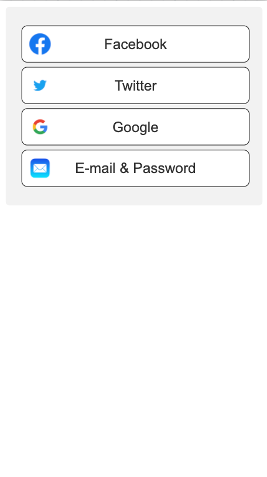
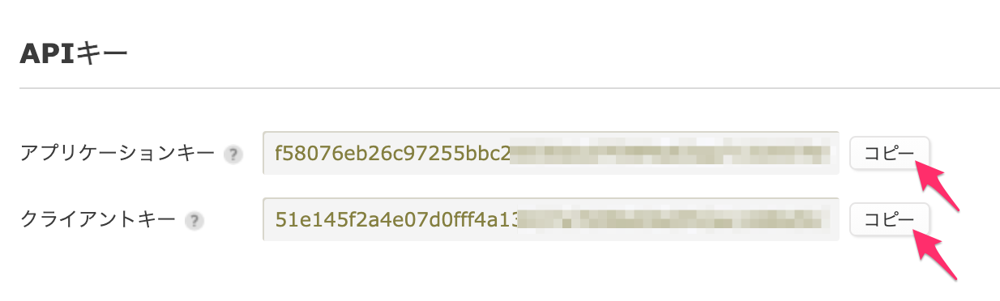
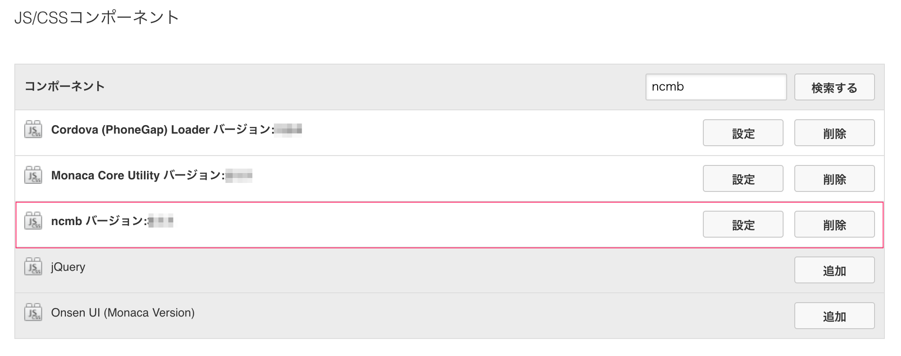
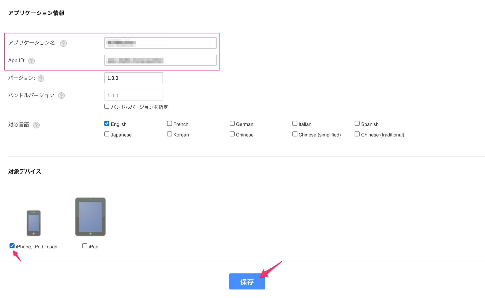
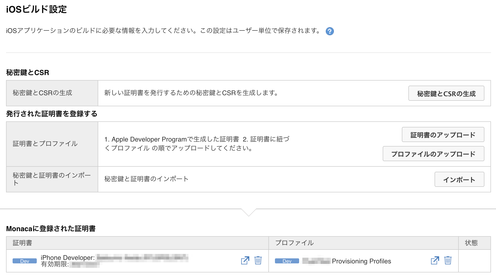
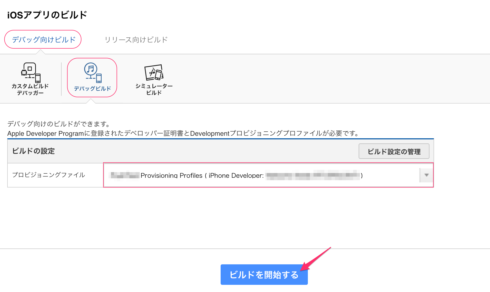
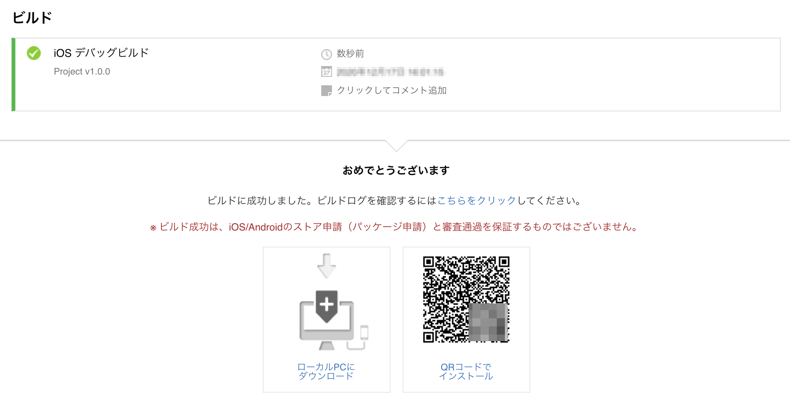
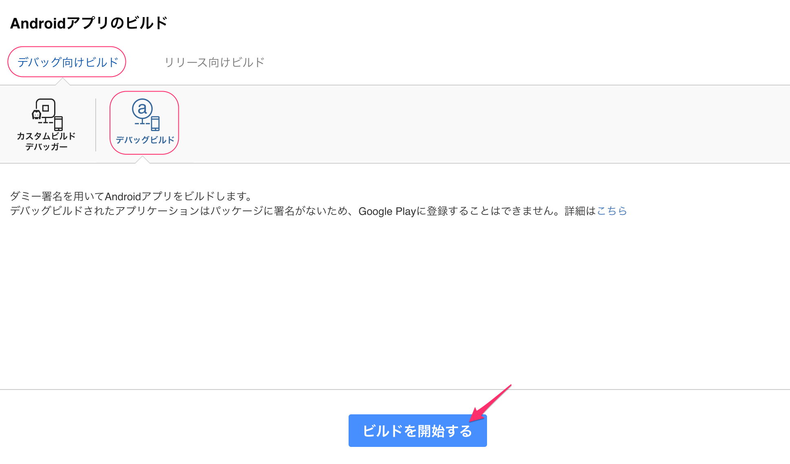
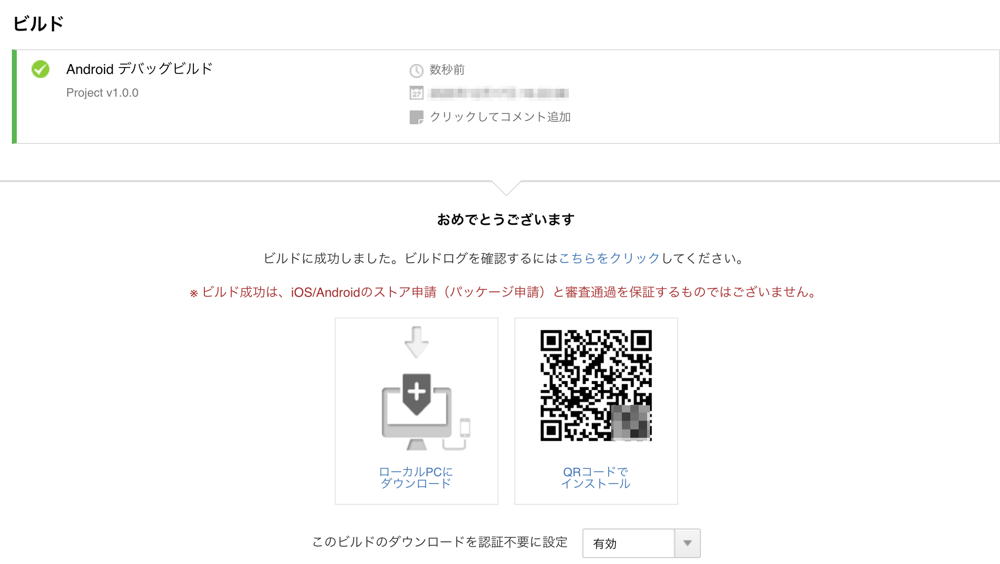

# MonacaSNSAuthenticationApp

【ニフクラ mobile backend 会員管理・認証機能】SNS認証（Facebook, Twitter, Google）& メールアドレス認証を搭載したサンプルアプリ

2020/12/15作成



## 目次
<!-- START doctoc generated TOC please keep comment here to allow auto update -->
<!-- DON'T EDIT THIS SECTION, INSTEAD RE-RUN doctoc TO UPDATE -->

- [はじめに](#%E3%81%AF%E3%81%98%E3%82%81%E3%81%AB)
- [作成するアプリの概要](#%E4%BD%9C%E6%88%90%E3%81%99%E3%82%8B%E3%82%A2%E3%83%97%E3%83%AA%E3%81%AE%E6%A6%82%E8%A6%81)
- [事前準備](#%E4%BA%8B%E5%89%8D%E6%BA%96%E5%82%99)
- [サンプルアプリに実装済みの内容](#%E3%82%B5%E3%83%B3%E3%83%97%E3%83%AB%E3%82%A2%E3%83%97%E3%83%AA%E3%81%AB%E5%AE%9F%E8%A3%85%E6%B8%88%E3%81%BF%E3%81%AE%E5%86%85%E5%AE%B9)
- [動作確認に必要な作業内容](#%E5%8B%95%E4%BD%9C%E7%A2%BA%E8%AA%8D%E3%81%AB%E5%BF%85%E8%A6%81%E3%81%AA%E4%BD%9C%E6%A5%AD%E5%86%85%E5%AE%B9)
- [作業手順](#%E4%BD%9C%E6%A5%AD%E6%89%8B%E9%A0%86)
  - [1. mobile backend にアプリを作成する（全認証共通作業）](#1-mobile-backend-%E3%81%AB%E3%82%A2%E3%83%97%E3%83%AA%E3%82%92%E4%BD%9C%E6%88%90%E3%81%99%E3%82%8B%E5%85%A8%E8%AA%8D%E8%A8%BC%E5%85%B1%E9%80%9A%E4%BD%9C%E6%A5%AD)
    - [1.1. アプリの新規作成](#11-%E3%82%A2%E3%83%97%E3%83%AA%E3%81%AE%E6%96%B0%E8%A6%8F%E4%BD%9C%E6%88%90)
    - [1.2. APIキーの確認](#12-api%E3%82%AD%E3%83%BC%E3%81%AE%E7%A2%BA%E8%AA%8D)
  - [2. Monaca にプロジェクトを作成する（全認証共通作業）](#2-monaca-%E3%81%AB%E3%83%97%E3%83%AD%E3%82%B8%E3%82%A7%E3%82%AF%E3%83%88%E3%82%92%E4%BD%9C%E6%88%90%E3%81%99%E3%82%8B%E5%85%A8%E8%AA%8D%E8%A8%BC%E5%85%B1%E9%80%9A%E4%BD%9C%E6%A5%AD)
    - [2.1. プロジェクトのインポート](#21-%E3%83%97%E3%83%AD%E3%82%B8%E3%82%A7%E3%82%AF%E3%83%88%E3%81%AE%E3%82%A4%E3%83%B3%E3%83%9D%E3%83%BC%E3%83%88)
    - [2.2. mobile backend のJavaScript SDK を導入](#22-mobile-backend-%E3%81%AEjavascript-sdk-%E3%82%92%E5%B0%8E%E5%85%A5)
    - [2.3. mobile backend のAPIキーを設定](#23-mobile-backend-%E3%81%AEapi%E3%82%AD%E3%83%BC%E3%82%92%E8%A8%AD%E5%AE%9A)
  - [3. メールアドレス認証の動作確認をする](#3-%E3%83%A1%E3%83%BC%E3%83%AB%E3%82%A2%E3%83%89%E3%83%AC%E3%82%B9%E8%AA%8D%E8%A8%BC%E3%81%AE%E5%8B%95%E4%BD%9C%E7%A2%BA%E8%AA%8D%E3%82%92%E3%81%99%E3%82%8B)
  - [4. 各種SNS認証を連携する](#4-%E5%90%84%E7%A8%AEsns%E8%AA%8D%E8%A8%BC%E3%82%92%E9%80%A3%E6%90%BA%E3%81%99%E3%82%8B)
    - [4.1. Facebookとの連携と動作手順](#41-facebook%E3%81%A8%E3%81%AE%E9%80%A3%E6%90%BA%E3%81%A8%E5%8B%95%E4%BD%9C%E6%89%8B%E9%A0%86)
    - [4.2. Twitterとの連携と動作手順](#42-twitter%E3%81%A8%E3%81%AE%E9%80%A3%E6%90%BA%E3%81%A8%E5%8B%95%E4%BD%9C%E6%89%8B%E9%A0%86)
    - [4.3. Googleとの連携と動作手順](#43-google%E3%81%A8%E3%81%AE%E9%80%A3%E6%90%BA%E3%81%A8%E5%8B%95%E4%BD%9C%E6%89%8B%E9%A0%86)
    - [4.3. Appleとの連携と動作手順](#43-apple%E3%81%A8%E3%81%AE%E9%80%A3%E6%90%BA%E3%81%A8%E5%8B%95%E4%BD%9C%E6%89%8B%E9%A0%86)
  - [5. 実機にアプリをビルドする（全認証共通作業）](#5-%E5%AE%9F%E6%A9%9F%E3%81%AB%E3%82%A2%E3%83%97%E3%83%AA%E3%82%92%E3%83%93%E3%83%AB%E3%83%89%E3%81%99%E3%82%8B%E5%85%A8%E8%AA%8D%E8%A8%BC%E5%85%B1%E9%80%9A%E4%BD%9C%E6%A5%AD)
    - [5.1. iOS端末にビルド](#51-ios%E7%AB%AF%E6%9C%AB%E3%81%AB%E3%83%93%E3%83%AB%E3%83%89)
    - [5.2. Android端末にビルド](#52-android%E7%AB%AF%E6%9C%AB%E3%81%AB%E3%83%93%E3%83%AB%E3%83%89)

<!-- END doctoc generated TOC please keep comment here to allow auto update -->

## はじめに

* スマートフォンアプリの利用開始時に認証情報を新しく登録する
* 既存のSNSアカウントを利用してログインができる

ユーザー目線で考えると後者の方が圧倒的にスムーズにアプリの利用開始を行うことができそうです。しかし、SNS認証ってどうやって取り入れたらいいのか？SNSアカウントを保持していないユーザーはどのように対処したらいいのか？など中々ハードルは高そうです。

本サンプルアプリでは ニフクラ mobile backend の会員管理・認証機能とSNS認証機能を連携させることでSNS認証もメールアドレス認証も同時に実現してしまう方法を提供します。

* 所要時間目安： ＊＊分～＊＊分程度

## 作成するアプリの概要

ニフクラ mobile backend の「会員管理認証機能」として利用可能な __SNS認証機能__ （Facebook, Twitter, Google）及び __メールアドレス認証機能__ の併用を想定したサンプルアプリです。


## 事前準備
* 開発環境準備
   * Windows でも Mac でもブラウザとして「Google Chrome」のインストールされていれば利用可能です
      * （参考） Mac OS 10.15.6 (Catalina) にて検証済み
   * 動作確認端末（Android または iOS）
      * 本サンプルアプリの動作確認には実機へのビルドが必要です
         * iOS端末にビルドする場合は、別途[AppleDeveloperProgram](https://developer.apple.com/account/) への登録(11,800 円/年間)が必要です
      * （参考）検証端末: iPhoneX iOS 13.5.1 にて検証済み
* ニフクラ mobile backend アカウント作成 ＞ 下記URLよりSNSアカウントにて登録（無料）
   * https://mbaas.nifcloud.com/doc/current/
* Monaca または Monaca Education アカウント作成 ＞ 下記URLより登録（有料）
   * Monaca https://monaca.mobi/ja/signup
      * サードパーティ製の Cordova plugin を利用するため、「Pro」プラン以上の契約で利用可能です
   * Monaca Education https://monaca.education/ja/signup
      * サードパーティ製の Cordova plugin を利用するため、「Education Gold」プラン以上の契約で利用可能です

## サンプルアプリに実装済みの内容

* コーディング
   * ただし、動作確認には各種SNSとの連携に関する作業及びID等の埋め込みが必要です
* 使用する以下 Cordova plugin の組み込み
   * Facebook: cordova-plugin-facebook4 v6.4.0       
   * Twitter: ccordova-plugin-twitter-connect-wkwebview  v1.0.1
   * Google: cordova-plugin-googleplus v8.5.1

※いずれもサードパーティ製の Cordova plugin となります。本サンプルアプリでは上記を利用しておりますが、弊社サービスとは無関係のため、動作保証対象外となります。ご了承ください。

## 動作確認に必要な作業内容

1. mobile backend にアプリを作成する（全認証共通作業）
   1. アプリの新規作成
   2. APIキーの確認
2. Monaca にプロジェクトを作成する（全認証共通作業）
   1. プロジェクトのインポート
   2. mobile backend のJavaScript SDK を導入
   3. mobile backend のAPIキーを設定
3. メールアドレス認証の動作確認をする
4. 各種SNS認証を連携する
   1. Facebookとの連携と動作手順
   2. Twitterとの連携と動作手順
   3. Googleとの連携と動作手順
   4. Appleとの連携と動作手順
5. 実機にアプリをビルドする（全認証共通作業）
   1. iOS端末にビルド
   2. Android端末にビルド

※本チュートリアルの手順通り実装しても正しく動作しない場合、「Issues」＞「New issue」より issue を作成（タイトル及び概要の入力）の上、ご報告ください。順次改修いたします。

## 作業手順
### 1. mobile backend にアプリを作成する（全認証共通作業）
#### 1.1. アプリの新規作成
* mobile backend 管理画面にログインし、アプリを作成します。
   * 既にアプリが１つ以上存在する場合は「+新しいアプリ」をクリックします
* アプリ名を入力し、「新規作成」をクリックします
   * 例）アプリ名「SNSApp」
* アプリが作成されるとAPIキーが表示されますが、ここでは「OK」ボタンをクリックして画面を閉じます
* アプリの管理画面（ダッシュボード）が表示されます

（参考）[クイックスタート：アプリの新規作成 \| ニフクラ mobile backend](https://mbaas.nifcloud.com/doc/current/introduction/div_quickstart_javascript_monaca.html#アプリの新規作成)


#### 1.2. APIキーの確認

このあと作成する Monacaプロジェクトに、先ほど mobile backend でアプリ作成時に発行されたAPIキー（アプリケーションキー、クライアントキー）を埋め込むことでフロントエンド（クライアントアプリ）とバックエンド（サーバー）を連携することができます。

* 管理画面右上の「アプリ設定」＞「基本」＞「APIキー」から確認できます
* 「コピー」ボタンをクリックして利用します



### 2. Monaca にプロジェクトを作成する（全認証共通作業）
#### 2.1. プロジェクトのインポート
Monaca または Monaca Education にプロジェクトをインポートします。

* Monacaにログインしてダッシュボードを開き、「インポート」をクリックします
* 「プロジェクトのインポート」＞「インポート方法」＞「URL」をクリックします
* 下記URLを入力し、「次へ」をクリックします
  * `https://github.com/natsumo/MonacaSNSAuthenticationApp/archive/main.zip`

* 「プロジェクト名」を入力して「プロジェクトのインポート」をクリックするとプロジェクトが作成されます

#### 2.2. mobile backend のJavaScript SDK を導入

プロジェクトに mobile backend を Monaca から利用するための JavaScript SDK を導入します。

* 作成したプロジェクトを開き、メニューバーの「設定」＞「JS/CSSコンポーネントの追加と削除」をクリックします
* 「コンポーネント名」の入力欄に `ncmb` と入力し「検索」をクリックします
* 「ncmb」が表示されたら「追加」をクリックします
* 「バージョン」はそのまま（最新）で「インストール」をクリックします
* 「components/ncmb/ncmb.min.js」に必ずチェックをしてから「保存」をクリックします
* 一覧に表示されれば導入完了です



（参考） [クイックスタート：SDKのインストールと読み込み \| ニフクラ mobile backend](https://mbaas.nifcloud.com/doc/current/introduction/div_quickstart_javascript_monaca.html#SDKのインストールと読み込み)

#### 2.3. mobile backend のAPIキーを設定

Monaca プロジェクトに、mobile backend のAPIキーを埋め込み初期化処理を行います。

* 「js/service.js」ファイルを開きます
* 以下オブジェクト内 `YOUR_APPLICATION_KEY` と `YOUR_CLIENT_KEY` 部分にそれぞれ[1.2. APIキーの確認](#12-api%E3%82%AD%E3%83%BC%E3%81%AE%E7%A2%BA%E8%AA%8D)で確認したアプリケーションキー、クライアントキーに書き換えます

```js
const ncmbproperty = {
    application_key : "YOUR_APPLICATION_KEY",
    client_key: "YOUR_CLIENT_KEY"
}

/* 略 */

var ncmb = new NCMB(ncmbproperty.application_key, ncmbproperty.client_key);
```

[2.3. mobile backend のAPIキーを設定](#23-mobile-backend-%E3%81%AEapi%E3%82%AD%E3%83%BC%E3%82%92%E8%A8%AD%E5%AE%9A)で設定した JavaScript SDK、APIキーの設定及び初期化によって Monaca プロジェクトと mobile backend が連携されました。

### 3. メールアドレス認証の動作確認をする

メールアドレス認証のみ、アプリの実機ビルドなし（プレビュー画面）で動作確認ができます。

* ホゲホゲ

<!-- ★ここまで確認済み -->

### 4. 各種SNS認証を連携する

各種SNS認証（Facebook, Twitter, Google, Apple）との連携作業を実施し、動作確認をしてみましょう。

#### 4.1. Facebookとの連携と動作手順

[こちら](/readme-facebook.md)

#### 4.2. Twitterとの連携と動作手順

[こちら](/readme-twitter.md)

#### 4.3. Googleとの連携と動作手順

[こちら](/readme-google.md)

#### 4.3. Appleとの連携と動作手順

[こちら](/readme-apple.md)

<!-- ★以下確認済み -->

### 5. 実機にアプリをビルドする（全認証共通作業）

動作確認には「デバッグビルド」を行います。

#### 5.1. iOS端末にビルド

[AppleDeveloperProgram](https://developer.apple.com/account/)にログインし、ビルドに必要な証明書類を用意します。

* 開発用証明書
* 開発用プロビジョニングプロファイル

（参考）[iOS アプリのビルド \| Monaca Docs](https://docs.monaca.io/ja/products_guide/monaca_ide/build/ios/build_ios/)

ビルドに必要な設定をしていきます。

* Monaca プロジェクトを開き、メニューバーの「設定」＞「iOSアプリ設定」をクリックします
* 「アプリケーション名」と「App ID」を入力します
   * App ID は __プロビジョニングプロファイル__ 作成時に使用した App ID の Bundle ID と同じものを設定します
* 「対象デバイス」にチェックを入れ「保存」をクリックします



* 再び、メニューバーの「設定」＞「iOSビルド設定」をクリックします
* 開発用証明書及び開発用プロビジョニングプロファイルを設定します

開発用証明書の作成に必要なCSRファイルはMonaca上で作成する方法とMacのキーチェーンアクセスで作成する方法の２パターンあります（作業PCがWindowsのみでの利用の場合は前者の方法を利用します）。CSRの作り方によって操作が異なりますので、詳しくは下記ドキュメントをご覧ください。

（参考）[iOS アプリのビルド \| Monaca Docs](https://docs.monaca.io/ja/products_guide/monaca_ide/build/ios/build_ios/)

* アップロードされると「Monacaに登録された証明書」に記載されます



ビルドを実施します。

* メニューバーの「ビルド」＞「iOSアプリのビルド」をクリックします
* 「デバッグ向けビルド」＞「デバッグビルド」を選択します
* 「ビルドの設定」で今回使用する開発用プロビジョニングプロファイルを選択し「ビルドを開始する」をクリックします



* ビルドが完了したら、ipaファイルをダウンロードして端末に送るか、または直接端末でQRコードを読み取ってインストールします



#### 5.2. Android端末にビルド

* メニューバーの「ビルド」＞「Androidアプリのビルド」をクリックします
* 「デバッグ向けビルド」＞「デバッグビルド」を選択します
* 「ビルドを開始する」をクリックします



* ビルドが完了したら、apkファイルをダウンロードして端末に送るか、または直接端末でQRコードを読み取ってインストールします



（参考）[Android アプリのビルド \| Monaca Docs](https://docs.monaca.io/ja/products_guide/monaca_ide/build/build_android/)
