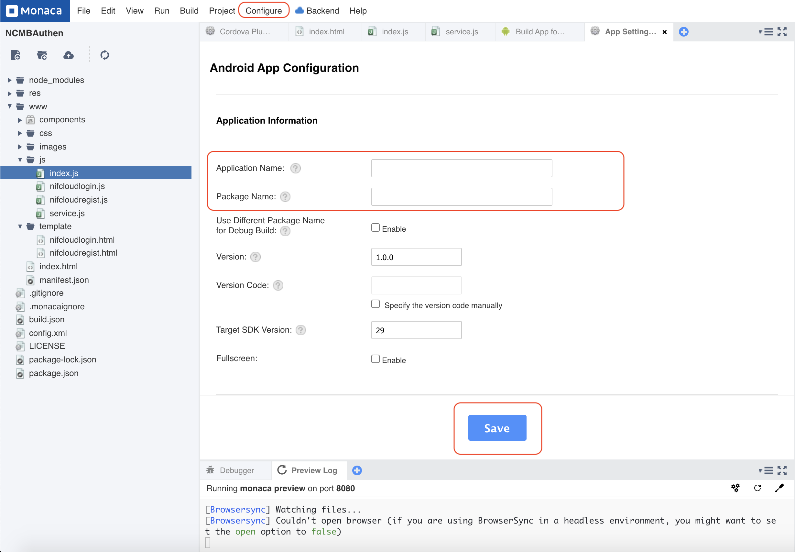

# MonacaSNSAuthenticationApp

【ニフクラ mobile backend 会員管理・認証機能】SNS認証（Facebook, Twitter, Google）& メールアドレス認証を搭載したサンプルアプリ

2020/12/15作成

## 目次
<!-- START doctoc generated TOC please keep comment here to allow auto update -->
<!-- END doctoc generated TOC please keep comment here to allow auto update -->

## はじめに

* スマートフォンアプリの利用開始時に認証情報を新しく登録する
* 既存のSNSアカウントを利用してログインができる

ユーザー目線で考えると後者の方が圧倒的にスムーズにアプリの利用開始を行うことができそうです。しかし、SNS認証ってどうやって取り入れたらいいのか？SNSアカウントを保持していないユーザーはどのように対処したらいいのか？など中々ハードルは高そうです。

本サンプルアプリでは ニフクラ mobile backend の会員管理・認証機能とSNS認証機能を連携させることでSNS認証もメールアドレス認証も同時に実現してしまう方法を提供します。

* 所要時間目安： ＊＊分～＊＊分程度

## 作成するアプリの概要

ニフクラ mobile backend の「会員管理認証機能」として利用可能な __SNS認証機能__ （Facebook, Twitter, Google）及び __メールアドレス認証機能__ の併用を想定したサンプルアプリです。

## 事前準備
* 開発環境準備
   * Windows でも Mac でもブラウザとして「Google Chrome」のインストールされていれば利用可能です
* ニフクラ mobile backend アカウント作成 ＞ 下記URLよりSNSアカウントにて登録（無料）
   * https://mbaas.nifcloud.com/doc/current/
* Monaca または Monaca Education アカウント作成 ＞ 下記URLより登録（Freeプランあり）
   * Monaca https://monaca.mobi/ja/signup
   * Monaca Education https://monaca.education/ja/signup
      * サードパーティ製の Cordova plugin を利用するため、Freeプランでは動作しない可能性があります（詳しくは Monaca サポートへお問い合わせください）

## サンプルアプリに実装済みの内容

* コーディング（実装）
   * ただし、動作確認には各種SNSとの連携に関する作業及びID等の埋め込みが必要です
* 使用する以下 Cordova plugin の組み込み
   * Facebook: cordova-plugin-facebook4 v6.4.0       
   * Twitter: ccordova-plugin-twitter-connect-wkwebview  v1.0.1
   * Google: cordova-plugin-googleplus v8.5.1

※いずれもサードパーティ製の Cordova plugin となります。本サンプルアプリでは上記を利用しておりますが、弊社サービスとは無関係のため、動作保証対象外となります。ご了承ください。

## 動作確認に必要な作業内容

1. mobile backend にアプリを作成する（共通）
2. Monaca にプロジェクトを作成する（共通）
3. 各種SNS認証を連携する
   1. Facebookと連携して動作確認をする
   2. Twitterと連携して動作確認をする
   3. Googleと連携して動作確認をする
4. メールアドレス認証の動作確認をする

※本チュートリアルの手順通り実装しても正しく動作しない場合、「Issues」＞「New issue」より issue を作成（タイトル及び概要の入力）の上、ご報告ください。順次改修いたします。

## 作業手順
### 1. mobile backend にアプリを作成する

mobile backend 管理画面にログインし、アプリを作成します。
* 例）アプリ名「SNSApp」
* 既にアプリが１つ以上存在する場合は「新しいアプリ」をクリックして作成する
* （参考） https://mbaas.nifcloud.com/doc/current/introduction/div_quickstart_javascript_monaca.html#アプリの新規作成

### 2. Monaca にプロジェクトを作成する
Monaca または Monaca Education にプロジェクトをインポートします。

* Monacaにログインしてダッシュボードを開き、「インポート」をクリックします
* 「プロジェクトのインポート」＞「インポート方法」＞「URL」をクリックします
* 下記URLを入力し、「次へ」をクリックします
  * `https://github.com/natsumo/MonacaSNSAuthenticationApp/archive/main.zip`

* 「プロジェクト名」を入力して「プロジェクトのインポート」をクリックするとプロジェクトが作成されます
* 作成したプロジェクトを開き、プロジェクトに mobile backend を Monaca から利用するための JavaScript SDK を導入します
   * 導入方法はドキュメントサイトを参照ください
     * https://mbaas.nifcloud.com/doc/current/introduction/div_quickstart_javascript_monaca.html#SDKのインストールと読み込み

<!-- ★ここまで確認済み -->

### 4. 各種SNS認証を連携する
#### 4.1. Facebookと連携して動作確認をする

[こちら](/readme-facebook.md)

#### 4.2. Twitterと連携して動作確認をする

[こちら](/readme-twitter.md)

#### 4.3. Googleと連携して動作確認をする

[こちら](/readme-google.md)

### 5. メールアドレス認証の動作確認をする
#### （④メールドレス/パスワード）Monacaの実装コード

* ニフクラ mobile backendを利用するために必要なJavaScript SDKは、下記の方法で導入済みです。
  - Monaca 画面上部にある「設定」＞「JS/CSSコンポーネント追加と削除」をクリック
  - 「ncmb」を入力して｢検索｣ボタンを押す
  - 「追加｣ボタンを押す
  -  最新バージョンを選択し ｢インストール開始｣ボタンを押す
  -  ローダーの設定は｢components/ncmb/min.js｣にチェックし｢OK｣ボタンを押す
  -  "JS/CSSコンポーネントをプロジェクトに追加しました。" 確認の｢OK｣ボタンを押す

## ①～④の動作確認手順
* アプリが起動したら、Login画面が表示されます
* Facebook/Twitter/Googleのボタンをそれぞれクリックします
    * Facebook/Twitter/Googleログインのブラウザが画面が表示されるのでしたがってログインを行います
    * ログインに失敗した場合は画面にエラー内容が表示されます（Facebook/Twitter/Googleログインのブラウザ画面でキャンセルした場合は表示されません）
    * 万が一エラーが発生した場合は、こちらよりエラー内容を確認いただけます
    * ログインに成功したらログアウトします

    

    

    * 管理画面からログインしたユーザーが確認できます  
    

* メールドレス/パスワード
    * 初回は __登録__ ボタンをクリックして、会員登録を行います
    * User NameとPasswordを２つ入力して _SignUp_ ボタンをタップします
    

    * 会員登録が成功するとログインされ、下記画面が表示されます
    
    * このときmBaaS上に会員情報が作成されます！
    
    * ログインに失敗した場合は画面にエラーコードが表示されます
    * 万が一エラーが発生した場合は、こちらよりエラー内容を確認いただけます
    * Logout ボタンをタップするとログアウトし、元の画面に戻ります
    
    * 登録された会員情報を使ってLogin画面からログインが可能です（操作は同様です）

---

## 参考情報

### アプリビルド手順
#### iOSのビルド案内

* Monacaで上メニューバーから`Configure → App settings for iOS` をクリックします。`Application Name`, `App ID`を入れて、`Save`ボタンで保存します。

* 続いてMonacaで上メニューバーから`Configure → Build settings for iOS`を選択します。`Certificates registered in Monaca` でプロビジョニングファイルとCertificatesをインポートします。

* 上メニューバーから`Build → Build app for iOS`を選択しますし、プロビジョニングファイルを選んでから`Start Build`ボタンでビルドできます・

#### Androidのビルド案内

* 上メニューバーから`Configure → App settings for Android`を選択します。`Certificates registered in Monaca` でプロビジョニングファイルとCertificatesをインポートします。

* 次はKeyStoreの設定手順で、上メニューバーから`Configure → Build settings for iOS`のところでKeystoreをインポートします。

* 最後は `Build → Build app for Android` から`Start Build`を選択してアプリをビルドします。

