# 4.1. Facebookとの連携と動作手順

Facebook連携にはサードパーティ製の Coedova plugin「cordova-plugin-facebook4 v6.4.0」を使用して作成しています。

## 目次
<!-- START doctoc generated TOC please keep comment here to allow auto update -->
<!-- DON'T EDIT THIS SECTION, INSTEAD RE-RUN doctoc TO UPDATE -->

- [事前準備](#%E4%BA%8B%E5%89%8D%E6%BA%96%E5%82%99)
- [動作確認に必要な作業内容](#%E5%8B%95%E4%BD%9C%E7%A2%BA%E8%AA%8D%E3%81%AB%E5%BF%85%E8%A6%81%E3%81%AA%E4%BD%9C%E6%A5%AD%E5%86%85%E5%AE%B9)
- [作業手順](#%E4%BD%9C%E6%A5%AD%E6%89%8B%E9%A0%86)
  - [1. facebookアプリの作成](#1-facebook%E3%82%A2%E3%83%97%E3%83%AA%E3%81%AE%E4%BD%9C%E6%88%90)
  - [2. 生成されたキーの確認と実行環境の設定](#2-%E7%94%9F%E6%88%90%E3%81%95%E3%82%8C%E3%81%9F%E3%82%AD%E3%83%BC%E3%81%AE%E7%A2%BA%E8%AA%8D%E3%81%A8%E5%AE%9F%E8%A1%8C%E7%92%B0%E5%A2%83%E3%81%AE%E8%A8%AD%E5%AE%9A)
    - [2.1. キーストア及びキーハッシュの生成手順](#21-%E3%82%AD%E3%83%BC%E3%82%B9%E3%83%88%E3%82%A2%E5%8F%8A%E3%81%B3%E3%82%AD%E3%83%BC%E3%83%8F%E3%83%83%E3%82%B7%E3%83%A5%E3%81%AE%E7%94%9F%E6%88%90%E6%89%8B%E9%A0%86)
  - [3. mobile backend 管理画面上での設定](#3-mobile-backend-%E7%AE%A1%E7%90%86%E7%94%BB%E9%9D%A2%E4%B8%8A%E3%81%A7%E3%81%AE%E8%A8%AD%E5%AE%9A)
  - [4. Coedova plugin へキーを埋め込む](#4-coedova-plugin-%E3%81%B8%E3%82%AD%E3%83%BC%E3%82%92%E5%9F%8B%E3%82%81%E8%BE%BC%E3%82%80)
- [動作手順](#%E5%8B%95%E4%BD%9C%E6%89%8B%E9%A0%86)
- [（参考）実装済みコードの紹介](#%E5%8F%82%E8%80%83%E5%AE%9F%E8%A3%85%E6%B8%88%E3%81%BF%E3%82%B3%E3%83%BC%E3%83%89%E3%81%AE%E7%B4%B9%E4%BB%8B)

<!-- END doctoc generated TOC please keep comment here to allow auto update -->

## 事前準備

* Facebook for Developers への登録（無料）
   * https://developers.facebook.com/
   * 利用には Facebookアカウントが必要です

## 動作確認に必要な作業内容

1. facebookアプリの作成
2. 生成されたキーの確認と実行環境の設定
3. mobile backend 管理画面上での設定
4. Coedova plugin へキーを埋め込む

## 作業手順
### 1. facebookアプリの作成

* Facebook for Developersにログインします
   * https://developers.facebook.com/
* 「マイアプリ」＞「アプリを作成」をクリックします
* ポップアップが表示されたら該当する内容を選び選択し「次へ」をクリックします
* 「アプリ表示名」を入力し「アプリを作成」をクリックします
   * 例）「NCMBAuthApp」
* アプリが作成され、ダッシュボードが開かれます

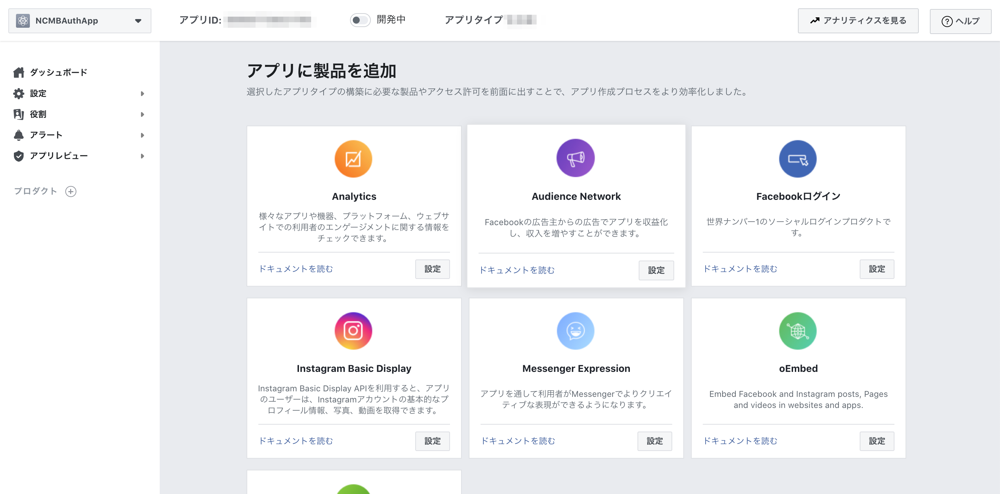

### 2. 生成されたキーの確認と実行環境の設定

後ほど mobile backend アプリ及び Monaca プロジェクトの Coedova plugin に設定する「アプリID」及び「表示名」の確認と、追加の必須設定をします。

* ダッシュボードで「設定」＞「ベーシック」をクリックします
* 「アプリID」及び「表示名」を確認します
   * これらは後で使用します
* 「プライバシーポリシーのURL」及び「ユーザーデータ削除」にURLを入力します
   * 実運用の場合は正確なURLを用意する必要がありますが、ここでは適当なURLを設定して問題ありません
* 「カテゴリ」を選択します   

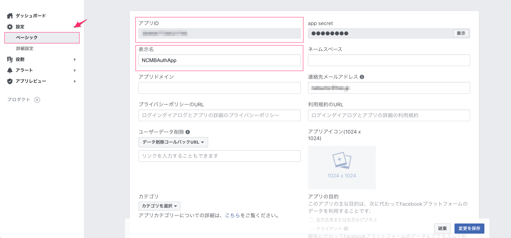
<!-- ★画像修正必要 -->

スマートフォンアプリ環境（iOS及びAndroid）での利用設定を行います。

* 同じ画面を一番下にスクロールして「+プラットフォームを追加」をクリックします

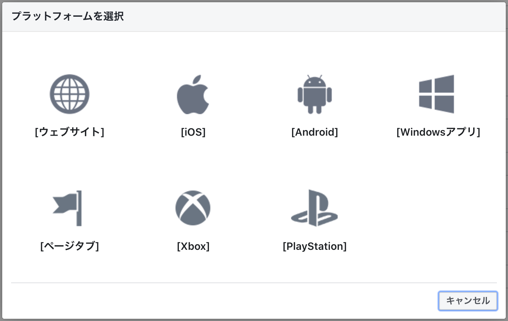

* 「iOS」をクリックします
* 「バンドルID」を入力します
   * 後にアプリをビルドする際、Monacaに設定する「App ID」と同じものを入力してください
   * （参考）[5.1. iOS端末にビルド](#51-ios%E7%AB%AF%E6%9C%AB%E3%81%AB%E3%83%93%E3%83%AB%E3%83%89)
* 「シングルサインオン」を有効（はい）にします

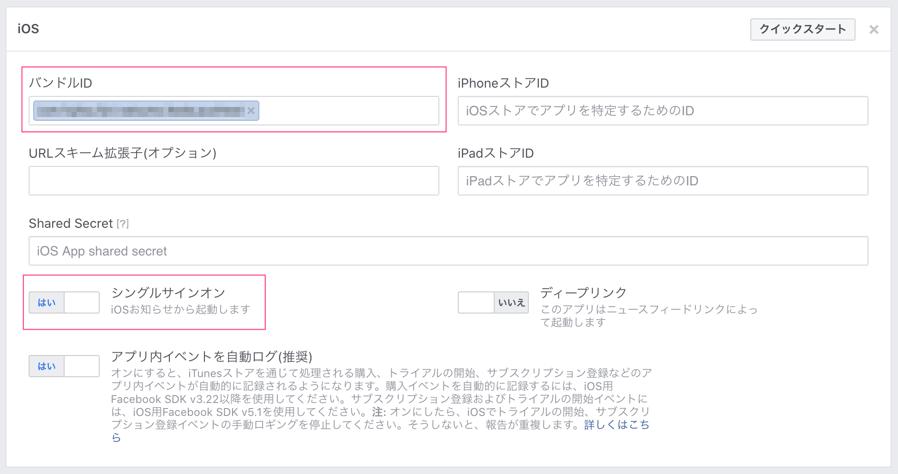

* 同様に「+プラットフォームを追加」をクリックします
* 「Android」をクリックします
* 「Google Playパッケージ名」を入力します
   * 後にアプリをビルドする際、Monacaに設定する「パッケージ名」と同じものを入力してください
   * （参考）[5.2. Android端末にビルド](#52-android%E7%AB%AF%E6%9C%AB%E3%81%AB%E3%83%93%E3%83%AB%E3%83%89)
* 「キーハッシュ」を入力します
   * 入力するキーハッシュは、この後記載の[2.1. キーストア及びキーハッシュの生成手順](#21-%E3%82%AD%E3%83%BC%E3%82%B9%E3%83%88%E3%82%A2%E5%8F%8A%E3%81%B3%E3%82%AD%E3%83%BC%E3%83%8F%E3%83%83%E3%82%B7%E3%83%A5%E3%81%AE%E7%94%9F%E6%88%90%E6%89%8B%E9%A0%86)にて生成したキーハッシュを入力します
* 「シングルサインオン」を有効（はい）にします
* 最後に一番下にある「変更を保存」をクリックします

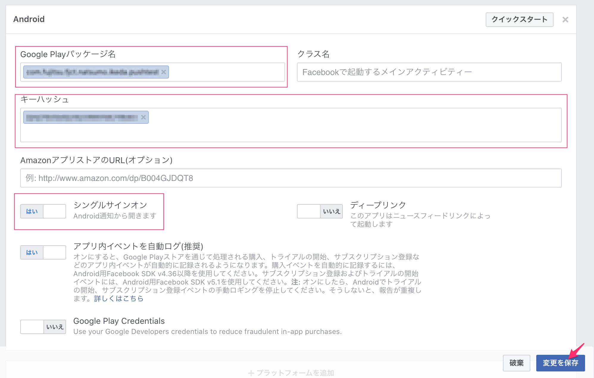

<!-- ここまで設定を追えたら、上部の「開発中」を「ライブ」に切り替えます。

 * 「開発中」のスイッチをクリックします
   * いくつかアラートが出てきますが、進んでください
 * 「ライブ」に切り替わればOKです -->
 <!-- ★画像を追加 -->

これで Facebook for Developers での設定は完了です。

#### 2.1. キーストア及びキーハッシュの生成手順

* Monaca を開きます
* メニューバーの「設定」＞「Androidキーストア設定」をクリックします
* 「キーストアとエイリアスの作成」の「新しく作成する」をクリックします

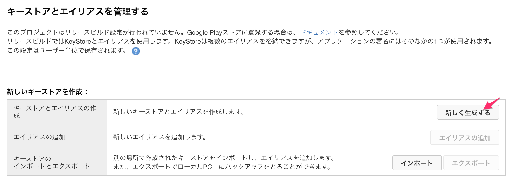

* 「エイリアス名」、「エイリアスのパスワード」及び「Keystoreのパスワードを入力してください」について入力し、「キーストアとエイリアスの作成」をクリックします

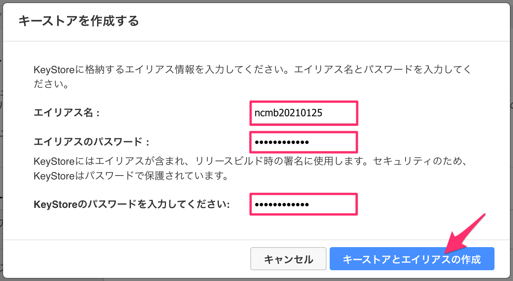

* キーストアが作成されtら「エクスポート」をクリックして任意の場所に書き出します
   * 書き出されるファイル「keystore.private」
* ターミナルを起動し、キーストアがエクスポートされてたリポジトリに移動します
* 次のコマンドを実行します
   * 「keystore.private」がダウンロードされたリポジトリに移動します
   * `YOUR_SETTING_ALIAS_NAME` はキーストア作成時に「エイリアス名」に設定してください

```bash
keytool -exportcert -alias YOUR_SETTING_ALIAS_NAME -keystore keystore.private | openssl sha1 -binary | openssl base64
```

* パスワードが要求されるので、キーストア作成時に「エイリアスのパスワード」に設定したパスワードを入力します
* キーハッシュが生成されるので、Facebook Developer の所定の場所（[2. 生成されたキーの確認と実行環境の設定](#2-%E7%94%9F%E6%88%90%E3%81%95%E3%82%8C%E3%81%9F%E3%82%AD%E3%83%BC%E3%81%AE%E7%A2%BA%E8%AA%8D%E3%81%A8%E5%AE%9F%E8%A1%8C%E7%92%B0%E5%A2%83%E3%81%AE%E8%A8%AD%E5%AE%9A)参照）に設定します

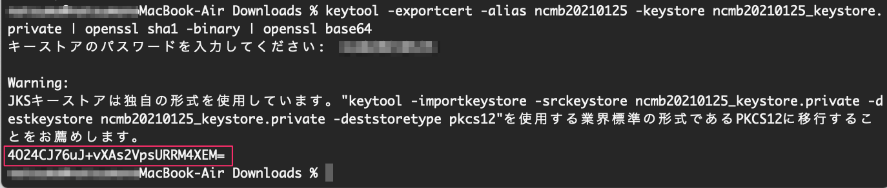<br>
※例ではダウンロードファイル名を「ncmb20210125_keystore.private」と変更しています。

（参考）[アプリケーション: キーストア内の SHA-1 フィンガープリントを確認する方法 ( Monaca クラウド IDE 上のキーストアを使用 ) \| Monaca Docs](https://docs.monaca.io/ja/faq/application/#%E3%82%AD%E3%83%BC%E3%82%B9%E3%83%88%E3%82%A2%E5%86%85%E3%81%AE-sha-1-%E3%83%95%E3%82%A3%E3%83%B3%E3%82%AC%E3%83%BC%E3%83%97%E3%83%AA%E3%83%B3%E3%83%88%E3%82%92%E7%A2%BA%E8%AA%8D%E3%81%99%E3%82%8B%E6%96%B9%E6%B3%95-monaca-%E3%82%AF%E3%83%A9%E3%82%A6%E3%83%89-ide-%E4%B8%8A%E3%81%AE%E3%82%AD%E3%83%BC%E3%82%B9%E3%83%88%E3%82%A2%E3%82%92%E4%BD%BF%E7%94%A8)

（参考）個人利用の場合はキーハッシュ作成に必要なJavaSE（Open JDK)は下記からダウンロードできます
http://openjdk.java.net/

### 3. mobile backend 管理画面上での設定

* mobile backend の管理画面を開き、右上の「アプリ設定」＞「SNS連携」を開きます
* 「Facebook連携」の「Facebook連携の許可」で「許可する」を選択します
* 「Facebook App ID」には [2. 生成されたキーの確認と実行環境の設定](#2-%E7%94%9F%E6%88%90%E3%81%95%E3%82%8C%E3%81%9F%E3%82%AD%E3%83%BC%E3%81%AE%E7%A2%BA%E8%AA%8D%E3%81%A8%E5%AE%9F%E8%A1%8C%E7%92%B0%E5%A2%83%E3%81%AE%E8%A8%AD%E5%AE%9A) で確認した「アプリID」をコピーして貼り付けます

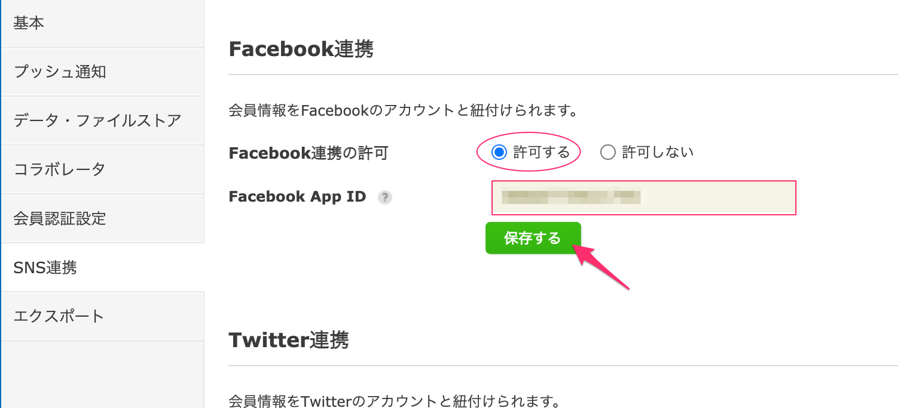

これで mobile backend の設定は完了です。

### 4. Coedova plugin へキーを埋め込む

Monacaに設定済みのサードパーティ製の Coedova plugin「cordova-plugin-facebook4 v6.4.0」に設定を追加します。

* Monacaプロジェクトを開き、メニューバーの「設定」＞「Coedovaプラグインの管理」をクリックします
* 「有効なプラグイン」の一覧から「cordova-plugin-facebook4 v6.4.0」を探し、カーソルを合わせるとポップアップが表示されるので「設定」をクッリックします

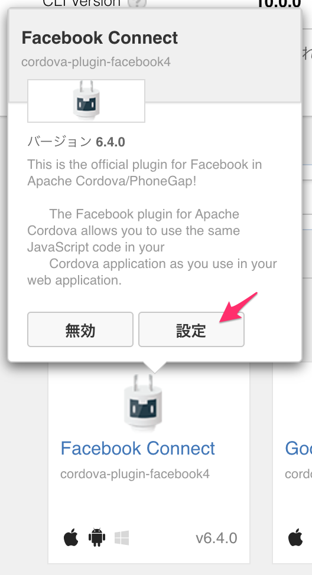

* [2. 生成されたキーの確認と実行環境の設定](#2-%E7%94%9F%E6%88%90%E3%81%95%E3%82%8C%E3%81%9F%E3%82%AD%E3%83%BC%E3%81%AE%E7%A2%BA%E8%AA%8D%E3%81%A8%E5%AE%9F%E8%A1%8C%E7%92%B0%E5%A2%83%E3%81%AE%E8%A8%AD%E5%AE%9A) で確認した「アプリID」及び「表示名」をそれぞれ `YOUR_FACEBOOK_APP_ID` 及び `YOUR_FACEBOOK_APP_NAME` にコピーして貼り付けます
* 入力が完了したら「OK」をクリックします

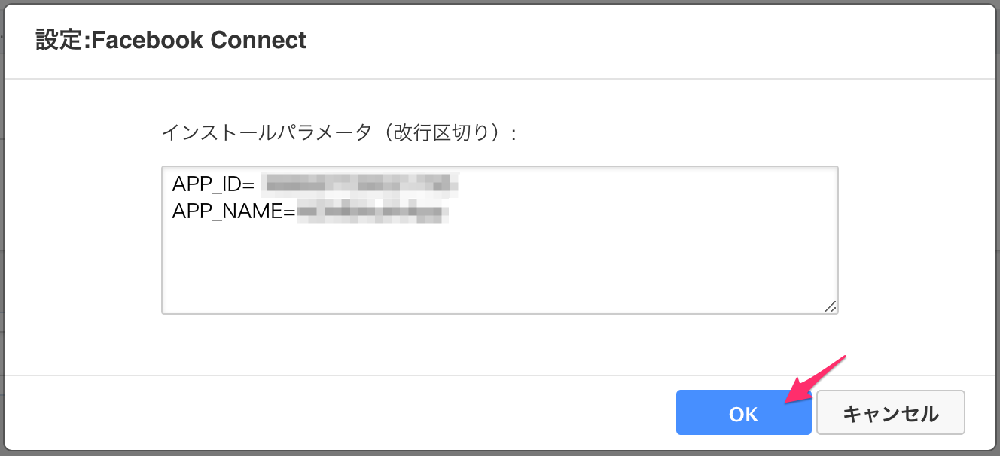

これで動作確認に必要な設定が全て完了しまし。

## 動作手順

* [5. 実機にアプリをビルドする（全認証共通作業）](#5-%E5%AE%9F%E6%A9%9F%E3%81%AB%E3%82%A2%E3%83%97%E3%83%AA%E3%82%92%E3%83%93%E3%83%AB%E3%83%89%E3%81%99%E3%82%8B%E5%85%A8%E8%AA%8D%E8%A8%BC%E5%85%B1%E9%80%9A%E4%BD%9C%E6%A5%AD)を参照して端末をアプリにビルドします
* アプリが起動したら「Facebook」のボタンをタップします

<!-- ★キャプチャを用意する -->

* Facebookログインのブラウザが画面が表示されるのでしたがってログインを行います

<!-- ★キャプチャを用意する -->

* 正しくログインがされると次の画面が表示されます

<!-- ★キャプチャを用意する -->

mobile backend の管理画面を確認するとFacebook連携で登録されたユーザー情報を確認するとができます。

* mobile backend の管理画面を開き、「会員管理」＞「全ての会員」を確認します

<!-- ★キャプチャを用意する -->

* Facebook認証の場合は「authData」フィールドに次のようにデータが格納されます

<!-- ★キャプチャを用意する -->

正しく動作しない場合はエラーがAlertに表示されます。作業手順を1つ1つ見直してみてください。また、次の注意事項も確認してください。

### 注意事項

* Android端末でかつ開発ビルドの場合、検証端末にFacebookアプリがインストールされているとキーハッシュの値が競合して正しく動作確認が行えないようです
   * Facebookアプリを一度アンインストールしてから試してください
   * リリースビルドの場合は問題ありません
* Facebook Developer の設定が正しく反映されないことがあるようです
   * その場合は一度アプリを削除して再度作り直すことで改善します

## （参考）実装済みコードの紹介

<!-- ★あとで追記する -->

<!--1. Componentsファイル

| File | Description |
| --- | --- |
| `index.html` | Login Page |
| `js/index.js` | 	A JavaScript file for implementation of the application |
| `js/service.js` | 	A JavaScript file for handle login  |


2. `config.xml`

```xml
<platform name="android">
    <preference name="android-minSdkVersion" value="22"/>
    ...
</platform>
```

3. `index.html`

```html
<a href="#" id="FacebookLoginBtn" data-role="button" data-inline="false" data-theme="b">Login with Facebook</a>
```
4. `js/index.js`

```javascript
//------ Login with Facebook ------//
var LoginSuccess = function(response) {
    onFacebookLogin(response);    
};

var LoginError = function(error) {
    console.log('Login Error: ' + JSON.stringify(error));
    alert('Error retrieving user profile' + JSON.stringify(error));
};

function onFacebookLoginBtn() {
    facebookConnectPlugin.login(['email', 'public_profile'], LoginSuccess, LoginError);
}
```

5. `js/service.js`

```javascript
/**
 * This const is your NCMB key
 */
const ncmbproperty = {
    application_key : "YOUR_APPLICATION_KEY",
    client_key: "YOUR_CLIENT_KEY"
};

var ncmb = new NCMB(ncmbproperty.application_key, ncmbproperty.client_key);

//------ Login with Facebook ------//
function onFacebookLogin(response) {
    if (response.status === 'connected') {
        var auth = response.authResponse;
        var expire_date = new Date(  auth.expiresIn * 1000 + (new Date()).getTime()).toJSON();
        var date = {__type:"Date", iso:expire_date};
        var authData = {id:auth.userID,
                        access_token:auth.accessToken,
                        expiration_date:date};
        var user = new ncmb.User();
        user.signUpWith("facebook", authData)
            .then(function(user){
                return ncmb.User.loginWith(user);
            })
            .then(function(user){
                currentLoginUser = ncmb.User.getCurrentUser();
                alert("User Info: " + JSON.stringify(user));
            })
            .catch(function(err){
                alert("エラー" + JSON.stringify(err));
            });
    } else if (response.status === 'not_authorized') {
        alert(response.status);
    } else {
        alert('Please login to facebook!');
    }
}
``` -->
