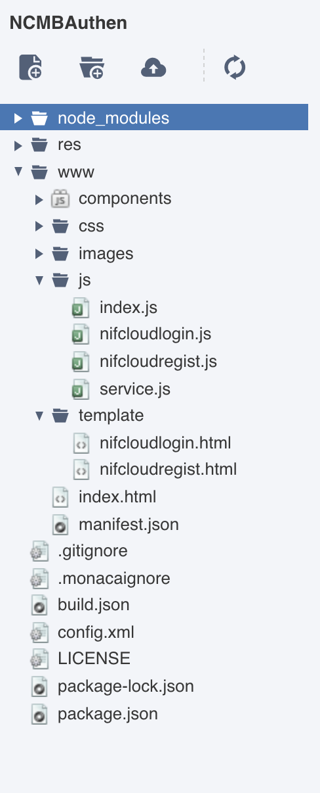

# 4.1. Facebookとの連携と動作手順

Facebook連携にはサードパーティ製の Coedova plugin「cordova-plugin-facebook4 v6.4.0」を使用して作成しています。

## 目次
<!-- START doctoc generated TOC please keep comment here to allow auto update -->
<!-- DON'T EDIT THIS SECTION, INSTEAD RE-RUN doctoc TO UPDATE -->

- [事前準備](#%E4%BA%8B%E5%89%8D%E6%BA%96%E5%82%99)
- [動作確認に必要な作業内容](#%E5%8B%95%E4%BD%9C%E7%A2%BA%E8%AA%8D%E3%81%AB%E5%BF%85%E8%A6%81%E3%81%AA%E4%BD%9C%E6%A5%AD%E5%86%85%E5%AE%B9)
- [作業手順](#%E4%BD%9C%E6%A5%AD%E6%89%8B%E9%A0%86)
  - [1. mobile backend 管理画面上での設定](#1-mobile-backend-%E7%AE%A1%E7%90%86%E7%94%BB%E9%9D%A2%E4%B8%8A%E3%81%A7%E3%81%AE%E8%A8%AD%E5%AE%9A)
  - [2. facebookアプリの作成](#2-facebook%E3%82%A2%E3%83%97%E3%83%AA%E3%81%AE%E4%BD%9C%E6%88%90)
  - [3. 生成されたキーの確認と実行環境の設定](#3-%E7%94%9F%E6%88%90%E3%81%95%E3%82%8C%E3%81%9F%E3%82%AD%E3%83%BC%E3%81%AE%E7%A2%BA%E8%AA%8D%E3%81%A8%E5%AE%9F%E8%A1%8C%E7%92%B0%E5%A2%83%E3%81%AE%E8%A8%AD%E5%AE%9A)
  - [4. pluginへキーを埋め込む](#4-plugin%E3%81%B8%E3%82%AD%E3%83%BC%E3%82%92%E5%9F%8B%E3%82%81%E8%BE%BC%E3%82%80)
- [動作手順](#%E5%8B%95%E4%BD%9C%E6%89%8B%E9%A0%86)
- [（参考）実装済みコードの紹介](#%E5%8F%82%E8%80%83%E5%AE%9F%E8%A3%85%E6%B8%88%E3%81%BF%E3%82%B3%E3%83%BC%E3%83%89%E3%81%AE%E7%B4%B9%E4%BB%8B)

<!-- END doctoc generated TOC please keep comment here to allow auto update -->

## 事前準備

* Facebook for Developers への登録（無料）
   * https://developers.facebook.com/

## 動作確認に必要な作業内容

1. mobile backend 管理画面上での設定
2. facebookアプリの作成
3. 生成されたキーの確認と実行環境の設定
4. pluginへキーを埋め込む

## 作業手順
### 1. mobile backend 管理画面上での設定

1. `App Settings`のところで`Social Login`を開きます
2. `Allow to login with facebok`で`allow`にチェックを入れますし、 `APP_ID` を入力します。


### 2. facebookアプリの作成

1. [Facebook for Developers](https://developers.facebook.com/)にログインします。

2. `My Apps → Create App`でアプリを作成します。

 

3. 必須な情報を入力したら、`Create App ID`をクリックします。

### 3. 生成されたキーの確認と実行環境の設定

<!-- `APP_ID`と`APP_NAME`は`cordova-plugin-facebook4`に必要なものだから、これからそれらを取得する方法を説明します。 -->

4. ダッシュボードの<i>Settings</i>から`APP_ID` (App ID) と `APP_NAME` を確認できます。
※　下で設定する必要があるから、どこかに保存してください。


5. `+ Add Platform` でプラットフォームを選択します。

6. Androidで実行する場合、`Android`を選択します。

* 以下の情報を入力したら、`Save Changes` を押してください。
    * `Google Play Package Name`: Android App SettingのMonaca Cloud IDEの設定でのAndroid’s Package Nameです。
    * `Key Hashes`: Android KeyStore SettingsのMonaca Cloud IDE で設定したKeyStoreのSHA-1 fingerprintです。SHA-1 fingerprintの取得方法は[こちら]((https://docs.monaca.io/en/faq/application/#how-to-get-sha-1-fingerprint-of-a-keystore-created-in-monaca-cloud-ide))でご参考ください。
    * `Single Sign On`を有効にします。
    
7. iOS端末で実行する場合、 `+ Add Platform`をクリックしたら`iOS`を選択します。
    * 以下の情報を入力しますし、`Save Changes`で保存します。
        * `Bundle ID`: iOS App SettingsのMonaca Cloud IDEで設定したiOSのApp IDです。
        * `Single Sign On`を有効にします。
    

### 4. pluginへキーを埋め込む

1. Monacaを開きます
2. 上記のメニューバーから`Configure → Cordova Plugin Settings`をキリックします。
3. `Enbaled plugins`のところで、 `cordova-plugin-facebook4`の`Configure`ボタンをクリックします。

4. 上で取得できた`APP_ID` と `APP_NAME`を入れます。

5. `OK`ボタンで保存します。

## 動作手順

[5. 実機にアプリをビルドする（全認証共通作業）](#5-%E5%AE%9F%E6%A9%9F%E3%81%AB%E3%82%A2%E3%83%97%E3%83%AA%E3%82%92%E3%83%93%E3%83%AB%E3%83%89%E3%81%99%E3%82%8B%E5%85%A8%E8%AA%8D%E8%A8%BC%E5%85%B1%E9%80%9A%E4%BD%9C%E6%A5%AD)を参照して端末をアプリにビルドできたら以下ので順で動作確認ができます。

* アプリが起動したら、Login画面が表示されます
* Facebook/Twitter/Googleのボタンをそれぞれクリックします
    * Facebook/Twitter/Googleログインのブラウザが画面が表示されるのでしたがってログインを行います
    * ログインに失敗した場合は画面にエラー内容が表示されます（Facebook/Twitter/Googleログインのブラウザ画面でキャンセルした場合は表示されません）
    * 万が一エラーが発生した場合は、こちらよりエラー内容を確認いただけます
    * ログインに成功したらログアウトします

    

    

    * 管理画面からログインしたユーザーが確認できます  
    

## （参考）実装済みコードの紹介

1. Componentsファイル

| File | Description |
| --- | --- |
| `index.html` | Login Page |
| `js/index.js` | 	A JavaScript file for implementation of the application |
| `js/service.js` | 	A JavaScript file for handle login  |



2. `config.xml`

```xml
<platform name="android">
    <preference name="android-minSdkVersion" value="22"/>
    ...
</platform>
```

3. `index.html`

```html
<a href="#" id="FacebookLoginBtn" data-role="button" data-inline="false" data-theme="b">Login with Facebook</a>
```
4. `js/index.js`

```javascript
//------ Login with Facebook ------//
var LoginSuccess = function(response) {
    onFacebookLogin(response);    
};

var LoginError = function(error) {
    console.log('Login Error: ' + JSON.stringify(error));
    alert('Error retrieving user profile' + JSON.stringify(error));
};

function onFacebookLoginBtn() {
    facebookConnectPlugin.login(['email', 'public_profile'], LoginSuccess, LoginError);
}
```

5. `js/service.js`

```javascript
/**
 * This const is your NCMB key
 */
const ncmbproperty = {
    application_key : "YOUR_APPLICATION_KEY",
    client_key: "YOUR_CLIENT_KEY"
};

var ncmb = new NCMB(ncmbproperty.application_key, ncmbproperty.client_key);

//------ Login with Facebook ------//
function onFacebookLogin(response) {
    if (response.status === 'connected') {
        var auth = response.authResponse;
        var expire_date = new Date(  auth.expiresIn * 1000 + (new Date()).getTime()).toJSON();
        var date = {__type:"Date", iso:expire_date};
        var authData = {id:auth.userID,
                        access_token:auth.accessToken,
                        expiration_date:date};
        var user = new ncmb.User();
        user.signUpWith("facebook", authData)
            .then(function(user){
                return ncmb.User.loginWith(user);
            })
            .then(function(user){
                currentLoginUser = ncmb.User.getCurrentUser();
                alert("User Info: " + JSON.stringify(user));
            })
            .catch(function(err){
                alert("エラー" + JSON.stringify(err));
            });
    } else if (response.status === 'not_authorized') {
        alert(response.status);
    } else {
        alert('Please login to facebook!');
    }
}
```
