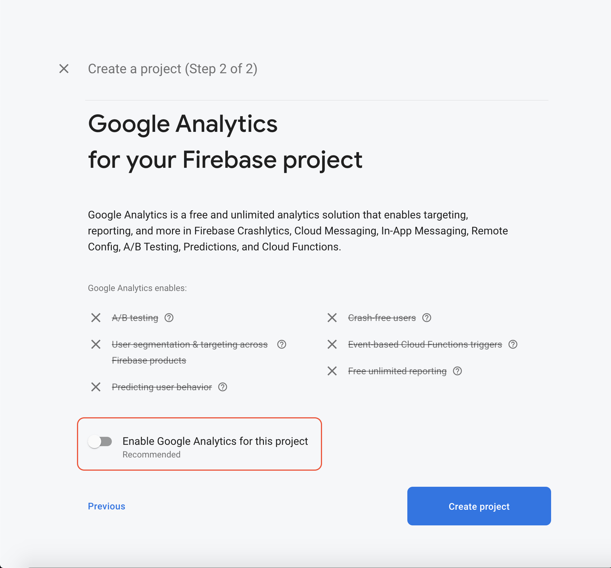
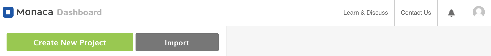

# I. Introduce


# II. （③Google）Google側作業手順

今回ではGoogleと連携できるように`cordova-plugin-googleplus`プラグインを使います。プラグイを使えるように`REVERSED_CLIENT_ID`がないといけません。それで、こちらでは`REVERSED_CLIENT_ID`の取得方法を説明します。
1. まず、 [Firebase console page](https://console.firebase.google.com/) にログインします
2. 次は`Your Firebase projects` の画面で `+ Add project` でプロジェクトを作成します

3. 必須な情報を入力したら、`Continue`で続きます。その後、 `Google Analytics for your Firebase project`画面で `Enable Google Analytics for this project` を無効にします。`Create project`でプロジェクトを作成します。

4. iOSアプリの場合、横のメニューから`Project setting >> General >> Add app >> iOS`タブを選択します
    `REVERSED_CLIENT_ID`は[cordova-plugin-googleplus](https://github.com/EddyVerbruggen/cordova-plugin-googleplus/releases/tag/8.5.1)のインストールに必要なもので、
    `GoogleService-Info.plist` をファイルをダウンロードして開くと`REVERSED_CLIENT_ID`を確認できます。
    また、`GoogleService-Info.plist` も`CLIENT_ID`を含んで、この`CLIENT_ID`は[mbaas設定](https://console.mbaas.nifcloud.com/)の`Login with Google` に必要なものです。それで、どこにメモしてください。
    
5. Androidアプリの場合、横のメニューから`Project setting >> General >> Add app >> Android`タブを選択します。`google-services.json`ファイルに`oauth_client` と `client_id` が含まれます。このIDは`Login with Google` インストールに必要なものだから、どこなにメモしてください。
- `SHA certificate fingerprints`はMonaca Cloud IDEのAndroid KeyStore Settings設定にKeyStoreです。
以下のリンクをご参考できればと思います。
[How to get SHA-1 fingerprint of a keystore created in Monaca Cloud IDE](https://docs.monaca.io/en/faq/application/#how-to-get-sha-1-fingerprint-of-a-keystore-created-in-monaca-cloud-ide).
    

# III. （③Google）管理画面上の設定
1. `App Settings`のところで`Social Login`を開きます
2. `allow`にチェックを入れます。
3. `GoogleService-Info.plist`の `CLIENT_ID` と`google-services.json` の`oauth_client >> client_id`を配列として入力してください。


# IV. （③Google）Monacaの実装コード
1. [Monaca](https://console.monaca.mobi/dashboard)にプロジェクトをインポートします
2. 「Import Project」をクリックすると、「プロジェクトのインポート」画面が表示されます
3. 「プロジェクト名」を入力します　例）MonacaApp
4. 「インポート方法」では、「URLを指定してインポート」を選択し、次のURLを入力します
https://github.com/vfaHungnv/MonacaFacebookLoginApp



## V. プラグイン設定
1. Monacaを開きます
2. 上記のメニューバーから`Configure → Cordova Plugin Settings`をキリックします。
3. `Enbaled plugins`のところで、 `cordova-plugin-googleplus`の`Configure`ボタンをクリックします。

 取得した`REVERSED_CLIENT_ID`を入れます。

4. `OK` で完了します。

# VI. コード説明
1. Componentsファイル

| File | Description |
| --- | --- |
| `index.html` | Login Page |
| `js/index.js` | 	A JavaScript file for implementation of the application |
| `js/service.js` | 	A JavaScript file for handle login  |


2. `config.xml`
```xml
<platform name="android">
    <preference name="android-minSdkVersion" value="22"/>
    ...
</platform>
```

3. `index.html`
```html
<button class="login-btn" onclick="onGoogleLoginBtn()">
    
    <span>Google</span>
</button>
```

4. `js/index.js`

Please update `CLIENT_ID` for `'webClientId' : '<!!NOTE-use-your-key-here!!>.apps.googleusercontent.com'`

```javascript
//------ Login with Google ------//
var googleLoginSuccess = function(response) {
    onGoogleLogin(response);
};

var googleLoginError = function(error) {
    console.log('Login Error: ' + JSON.stringify(error));
    alert('Error retrieving user profile' + JSON.stringify(error));
};

function onGoogleLoginBtn() {
    window.plugins.googleplus.login(
        {
            'webClientId' : '<!!NOTE-use-your-key-here!!>.apps.googleusercontent.com', // optional - clientId of your Web application from Credentials settings of your project - On Android, this MUST be included to get an idToken. On iOS, it is not required.
            'offline': true // Optional, but requires the webClientId - if set to true the plugin will also return a serverAuthCode, which can be used to grant offline access to a non-Google server
        },
        googleLoginSuccess, googleLoginError);
}
```

5. `js/service.js`
```javascript
/**
 * This const is your NCMB key
 */
const ncmbproperty = {
    application_key : "YOUR_APPLICATION_KEY",
    client_key: "YOUR_CLIENT_KEY"
};

/**
 * Your Twitter key :D
 */
const twitter_key = {
    oauth_consumer_key: "YOUR_TWITTER_KEY",
    consumer_secret: "YOUR_TWITTER_SECRET"
}

var ncmb = new NCMB(ncmbproperty.application_key, ncmbproperty.client_key);

//------ Login with Google ------//
function onGoogleLogin(response) {
    var authData = {
        id: response.userId,
        access_token: response.accessToken
    };
    var user = new ncmb.User();
    user.signUpWith("google", authData)
    .then(function(resUser){
        return ncmb.User.loginWith(resUser);
    })
    .then(function(user){
        currentLoginUser = ncmb.User.getCurrentUser();
        alert("User Info: " + JSON.stringify(user));
    })
    .catch(function(err){
        alert("エラー" + JSON.stringify(err));
    });
}
```


<!-- ## ③Google
### （③Google）Google側作業手順

* 今回ではGoogleと連携できるように`cordova-plugin-googleplus`プラグインを使います。プラグイを使えるように`REVERSED_CLIENT_ID`がないといけません。それで、こちらでは`REVERSED_CLIENT_ID`の取得方法を説明します。
1. まず、 [Firebase console page](https://console.firebase.google.com/) にログインします
2. 次は`Your Firebase projects` の画面で `+ Add project` でプロジェクトを作成します

3. 必須な情報を入力したら、`Continue`で続きます。その後、 `Google Analytics for your Firebase project`画面で `Enable Google Analytics for this project` を無効にします。`Create project`でプロジェクトを作成します。

4. iOSアプリの場合、横のメニューから`Project setting >> General >> Add app >> iOS`タブを選択します
    `REVERSED_CLIENT_ID`は[cordova-plugin-googleplus](https://github.com/EddyVerbruggen/cordova-plugin-googleplus/releases/tag/8.5.1)のインストールに必要なもので、
    `GoogleService-Info.plist` をファイルをダウンロードして開くと`REVERSED_CLIENT_ID`を確認できます。
    また、`GoogleService-Info.plist` も`CLIENT_ID`を含んで、この`CLIENT_ID`は[mbaas設定](https://console.mbaas.nifcloud.com/)の`Login with Google` に必要なものです。それで、どこにメモしてください。
    
5. Androidアプリの場合、横のメニューから`Project setting >> General >> Add app >> Android`タブを選択します。`google-services.json`ファイルに`oauth_client` と `client_id` が含まれます。このIDは`Login with Google` インストールに必要なものだから、どこなにメモしてください。
- `SHA certificate fingerprints`はMonaca Cloud IDEのAndroid KeyStore Settings設定にKeyStoreです。
以下のリンクをご参考できればと思います。
[How to get SHA-1 fingerprint of a keystore created in Monaca Cloud IDE](https://docs.monaca.io/en/faq/application/#how-to-get-sha-1-fingerprint-of-a-keystore-created-in-monaca-cloud-ide).
    

### （③Google）管理画面上の設定

1. `App Settings`のところで`Social Login`を開きます
2. `allow`にチェックを入れます。
3. `GoogleService-Info.plist`の `CLIENT_ID` と`google-services.json` の`oauth_client >> client_id`を配列として入力してください。


### （③Google）Monacaの実装コード
#### （③Google）プラグイン設定

1. Monacaを開きます
2. 上記のメニューバーから`Configure → Cordova Plugin Settings`をキリックします。
3. `Enbaled plugins`のところで、 `cordova-plugin-googleplus`の`Configure`ボタンをクリックします。

 取得した`REVERSED_CLIENT_ID`を入れます。

4. `OK` で完了します。


### （③Google）コード説明
1. Componentsファイル

| File | Description |
| --- | --- |
| `index.html` | Login Page |
| `js/index.js` | 	A JavaScript file for implementation of the application |
| `js/service.js` | 	A JavaScript file for handle login  |


2. `config.xml`
```xml
<platform name="android">
    <preference name="android-minSdkVersion" value="22"/>
    ...
</platform>
```

3. `index.html`
```html
<button class="login-btn" onclick="onGoogleLoginBtn()">
    
    <span>Google</span>
</button>
```

4. `js/index.js`

Please update `CLIENT_ID` for `'webClientId' : '<!!NOTE-use-your-key-here!!>.apps.googleusercontent.com'`

```javascript
//------ Login with Google ------//
var googleLoginSuccess = function(response) {
    onGoogleLogin(response);
};

var googleLoginError = function(error) {
    console.log('Login Error: ' + JSON.stringify(error));
    alert('Error retrieving user profile' + JSON.stringify(error));
};

function onGoogleLoginBtn() {
    window.plugins.googleplus.login(
        {
            'webClientId' : '<!!NOTE-use-your-key-here!!>.apps.googleusercontent.com', // optional - clientId of your Web application from Credentials settings of your project - On Android, this MUST be included to get an idToken. On iOS, it is not required.
            'offline': true // Optional, but requires the webClientId - if set to true the plugin will also return a serverAuthCode, which can be used to grant offline access to a non-Google server
        },
        googleLoginSuccess, googleLoginError);
}
```

5. `js/service.js`
```javascript
/**
 * This const is your NCMB key
 */
const ncmbproperty = {
    application_key : "YOUR_APPLICATION_KEY",
    client_key: "YOUR_CLIENT_KEY"
};

/**
 * Your Twitter key :D
 */
const twitter_key = {
    oauth_consumer_key: "YOUR_TWITTER_KEY",
    consumer_secret: "YOUR_TWITTER_SECRET"
}

var ncmb = new NCMB(ncmbproperty.application_key, ncmbproperty.client_key);

//------ Login with Google ------//
function onGoogleLogin(response) {
    var authData = {
        id: response.userId,
        access_token: response.accessToken
    };
    var user = new ncmb.User();
    user.signUpWith("google", authData)
    .then(function(resUser){
        return ncmb.User.loginWith(resUser);
    })
    .then(function(user){
        currentLoginUser = ncmb.User.getCurrentUser();
        alert("User Info: " + JSON.stringify(user));
    })
    .catch(function(err){
        alert("エラー" + JSON.stringify(err));
    });
}
```
 -->
