# I. Introduce


# II. （②Twitter）Twitter側作業手順

Twitter連携するように[cordova-plugin-twitter-connect-wkwebview](https://github.com/tien271/cordova-plugin-twitter-connect-wkwebview/releases/tag/v1.0.1)のプラグインを使います。このプラグインを使うように`TWITTER_KEY` と `TWITTER_SECRET`が必要です。

1. [Twitter Apps page](https://developer.twitter.com/en/portal/projects-and-apps)にログインします。
2. `Standalone Apps` click on `+ Create App` button.
 `Standalone Apps`のところで`+ Create App`でアプリを作成します。
3. 必須な情報を入力したら、 `Complete`でアプリを作成します。
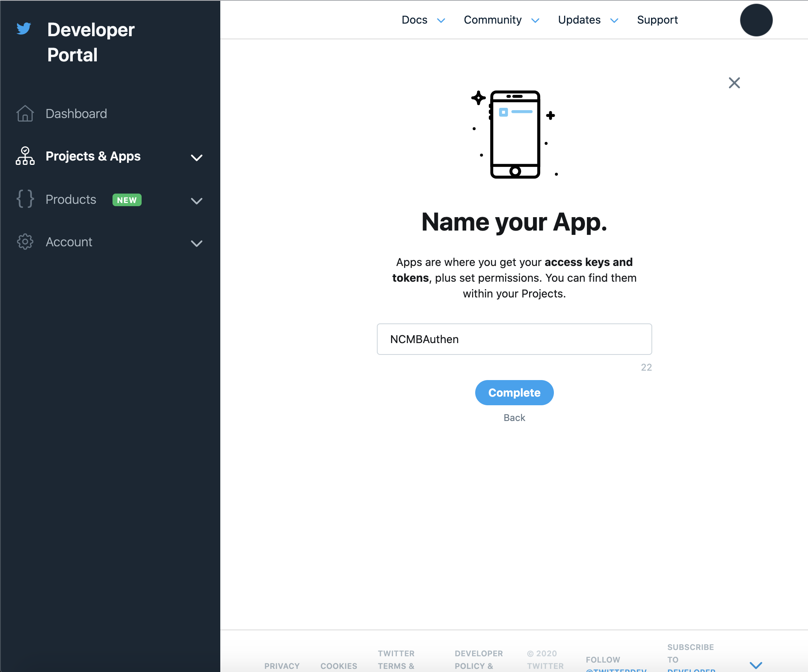
※注意: `TWITTER_KEY`は`API key`で、`TWITTER_SECRET`は`API secret key`です。
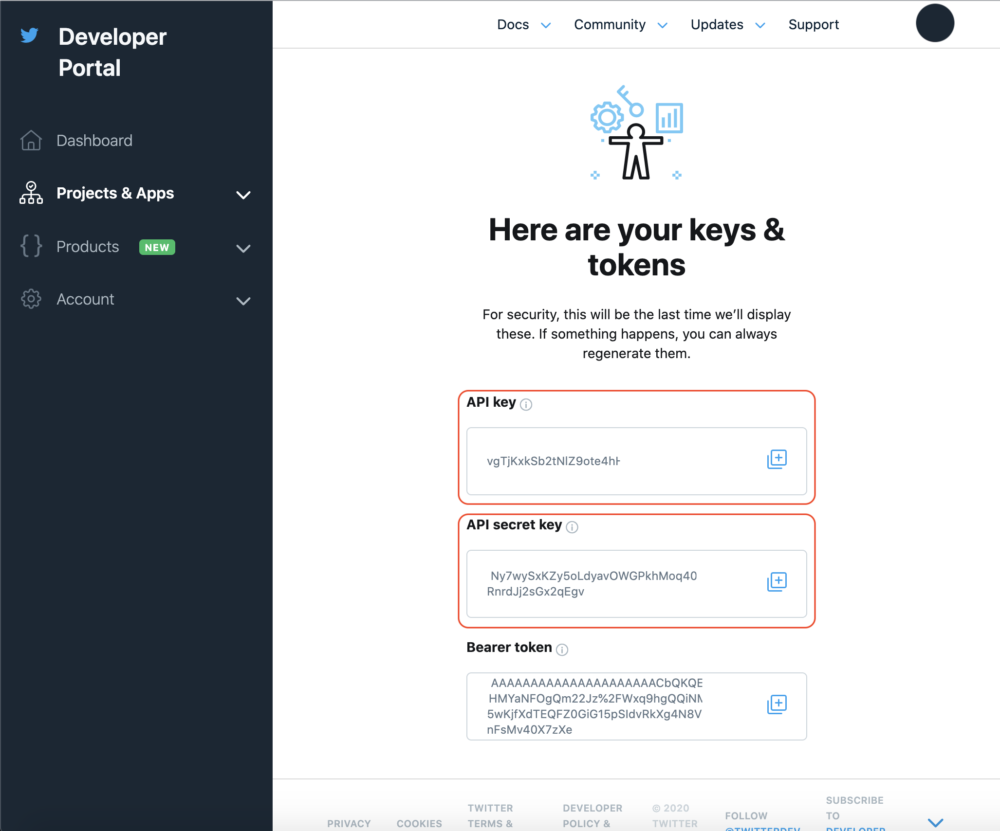
5. 下のSetup your Appで`enable 3rd party authentication` のリンクをクリックします。
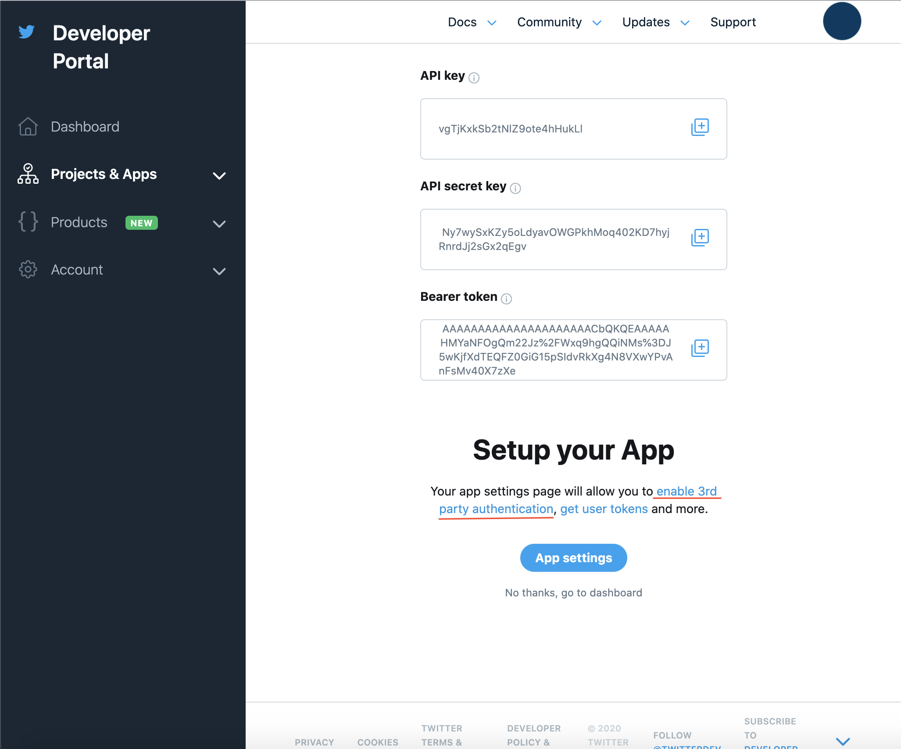
6. `App permission`を `Read and Write`に設定します。  
 `Authentication settings` で`3-legged OAuth is enabled`を有効いします。  
 また、Callback URLで`twittersdk://`を設定する必要があります。  
 最後は`Website URL`のURLを入力してください。`Save` ボタンで保存します。  
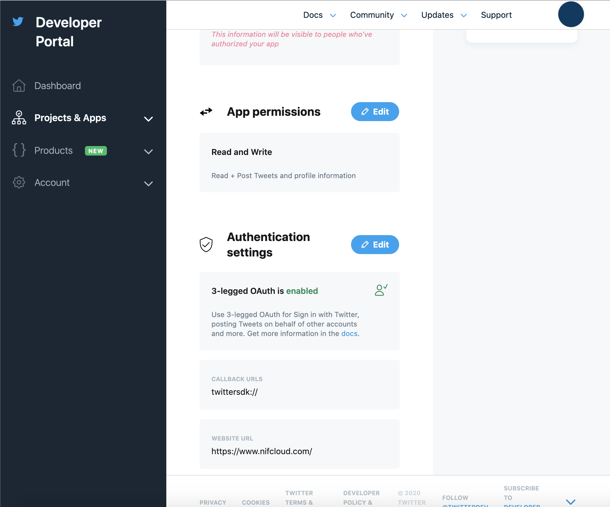

# III. （②Twitter）管理画面上の設定

1. `App Settings`のところで`Social Login`を開きます
2. `allow`にチェックを入れます。
3.`TWITTER_KEY`を入力します。
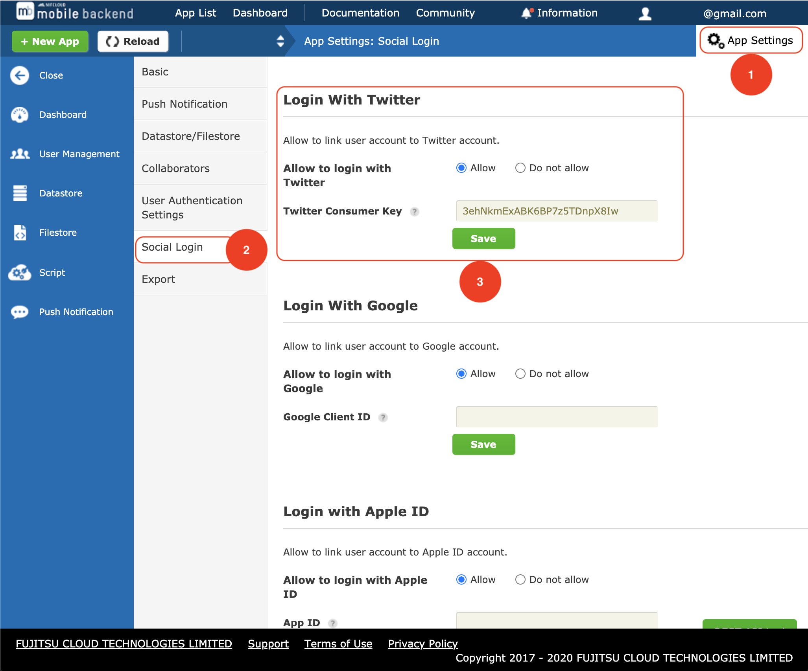

# IV. （②Twitter）Monacaの実装コード

1. [Monaca](https://console.monaca.mobi/dashboard)にプロジェクトをインポートします
2. 「Import Project」をクリックすると、「プロジェクトのインポート」画面が表示されます
3. 「プロジェクト名」を入力します　例）MonacaApp
4. 「インポート方法」では、「URLを指定してインポート」を選択し、次のURLを入力します
https://github.com/vfaHungnv/MonacaFacebookLoginApp
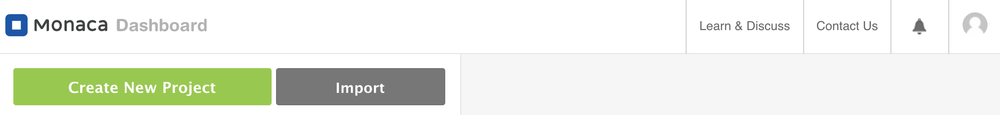

## V. プラグイン設定

1. Monacaを開きます
2. 上記のメニューバーから`Configure → Cordova Plugin Settings`をキリックします。
3. `Enbaled plugins`のところで、 `cordova-plugin-twitter-connect-wkwebview`の`Configure`ボタンをクリックします。
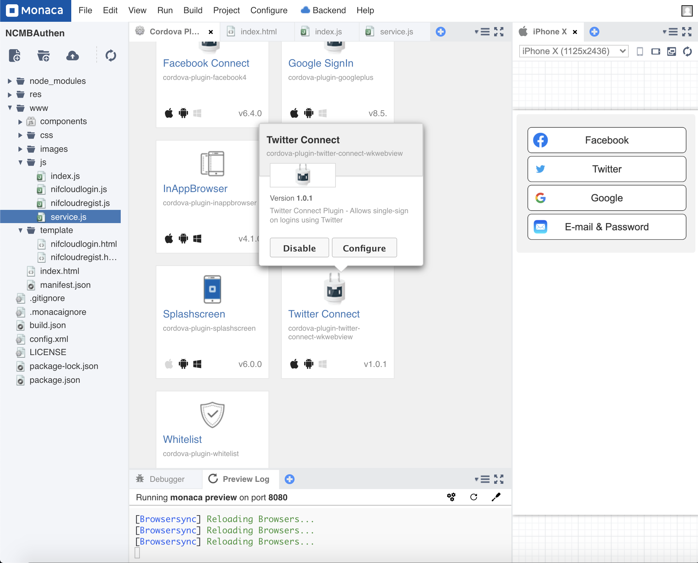
4. 取得した`TWITTER_KEY`、`TWITTER_SECRET`、 `FABRIC_KEY`　を入れます。
※ `FABRIC_KEY`は`FABRIC_KEY=empty`です。
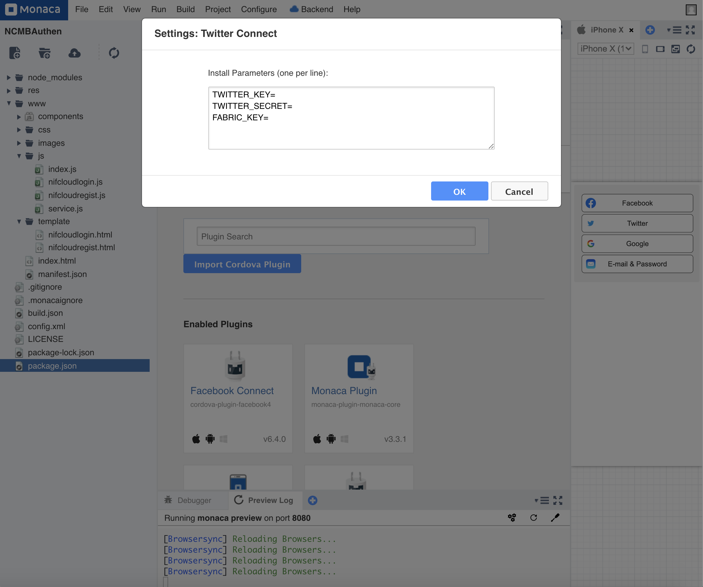
4. `OK`で完了します。

# VI. コード説明
1. File Components

| File | Description |
| --- | --- |
| `index.html` | Login Page |
| `js/index.js` | 	A JavaScript file for implementation of the application |
| `js/service.js` | 	A JavaScript file for handle login  |

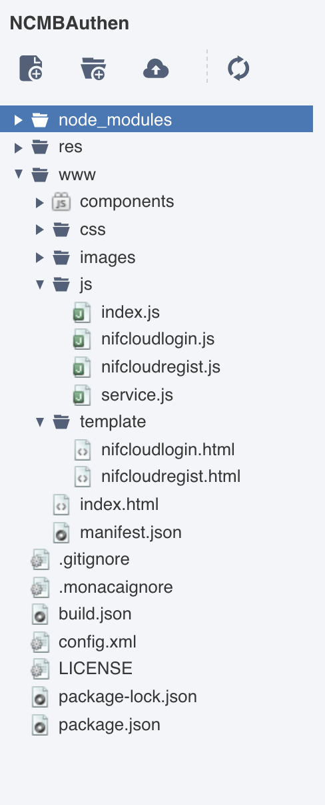

2. `config.xml`
```xml
<platform name="android">
    <preference name="android-minSdkVersion" value="22"/>
    ...
</platform>
```

3. `index.html`
```html
<button class="login-btn" onclick="onTwitterLoginBtn()">
    
    <span>Twitter</span>
</button>
```

4. `js/index.js`
```javascript
//------ Login with Twitter ------//
var twitterLoginSuccess = function(response) {
    onTwitterLogin(response);
};

var twitterLoginError = function(error) {
    console.log('Login Error: ' + JSON.stringify(error));
    alert('Error retrieving user profile' + JSON.stringify(error));
};

function onTwitterLoginBtn() {
    TwitterConnect.login(twitterLoginSuccess, twitterLoginError);
}
```

5. `js/service.js`
```javascript
/**
 * This const is your NCMB key
 */
const ncmbproperty = {
    application_key : "YOUR_APPLICATION_KEY",
    client_key: "YOUR_CLIENT_KEY"
};

/**
 * Your Twitter key :D
 */
const twitter_key = {
    oauth_consumer_key: "YOUR_TWITTER_KEY",
    consumer_secret: "YOUR_TWITTER_SECRET"
}

var ncmb = new NCMB(ncmbproperty.application_key, ncmbproperty.client_key);

//------ Login with Twitter ------//
function onTwitterLogin(response) {
    var authData = {
        id: response.id,
        screen_name: response.userName,
        oauth_consumer_key: twitter_key.oauth_consumer_key,
        consumer_secret: twitter_key.consumer_secret,
        oauth_token: response.authToken,
        oauth_token_secret: response.authTokenSecret
    };
    var user = new ncmb.User();
    user.signUpWith("twitter", authData)
    .then(function(resUser){
        return ncmb.User.loginWith(resUser);
    })
    .then(function(user){
        currentLoginUser = ncmb.User.getCurrentUser();
        alert("User Info: " + JSON.stringify(user));
    })
    .catch(function(err){
        alert("エラー" + JSON.stringify(err));
    });
}

function onTwitterLogout() {
    TwitterConnect.logout(
        function() {
            console.log('Successful logout!');
        },
        function() {
            console.log('Error logging out');
        }
    );
}
```

# VII. Build Application
1. Build app for iOS.
    - App settings for iOS: From Monaca Cloud IDE menu, go to `Configure → App settings for iOS` input `Application Name`, `App ID` and click `Save` button.
    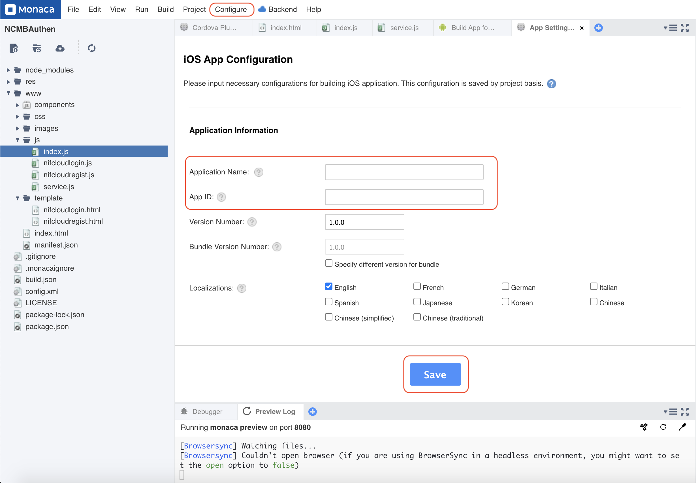
    - Build settings for iOS: From Monaca Cloud IDE menu, go to `Configure → Build settings for iOS` and import provisioning, certificate `Certificates registered in Monaca` to build for real devices.
    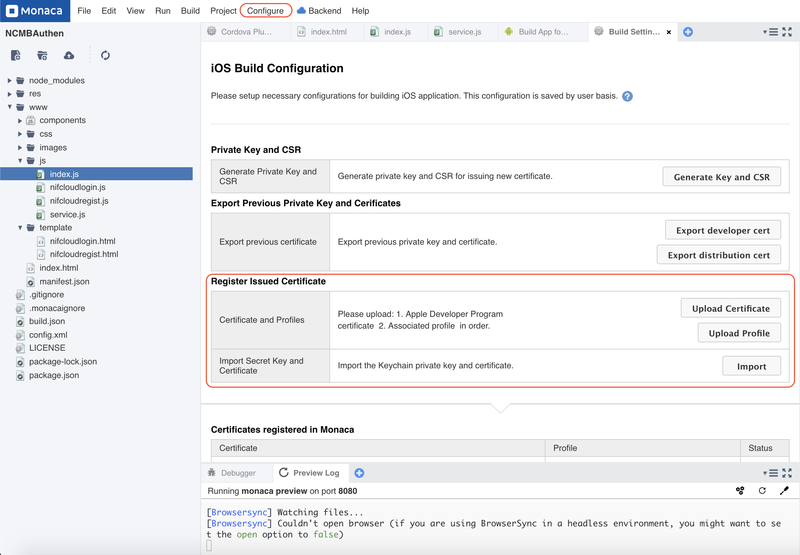
    - Build app for iOS: From Monaca Cloud IDE menu, go to `Build → Build app for iOS`, select provisioning is values you got in the settings above and click `Start Build`
    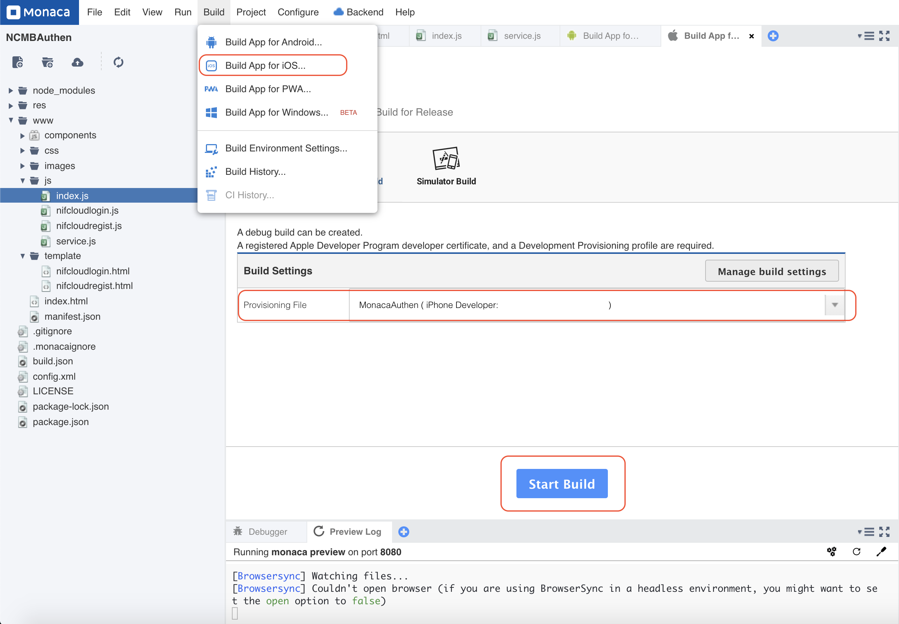
    - Please wait a moment.

2. Build app for Android
    - App settings for Android: From Monaca Cloud IDE menu, go to `Configure → App settings for Android` input `Application Name`, `Package Name` and click `Save` button.
    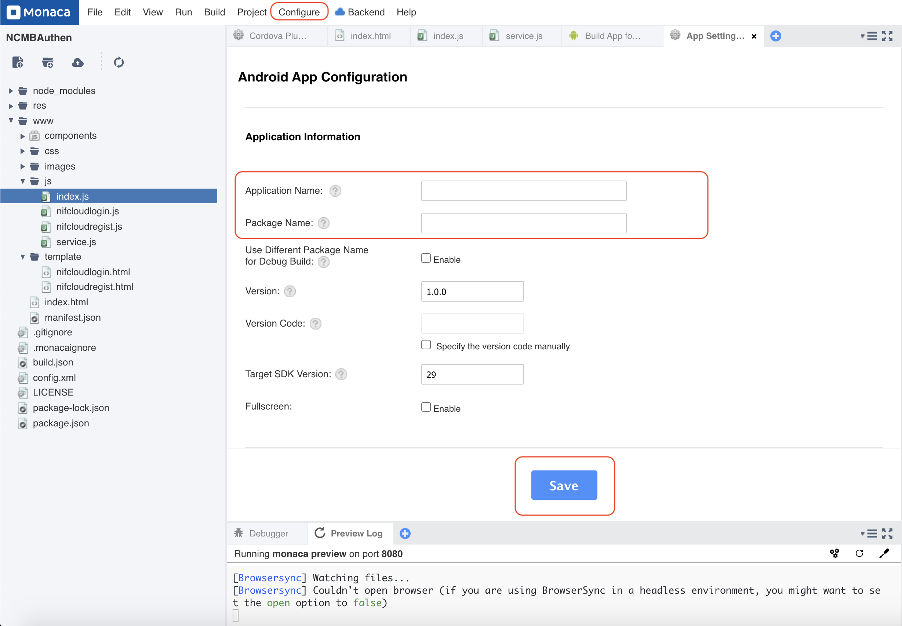
    - KeyStore settings for Android: From Monaca Cloud IDE menu, go to `Configure → Build settings for iOS`and import keystore.
    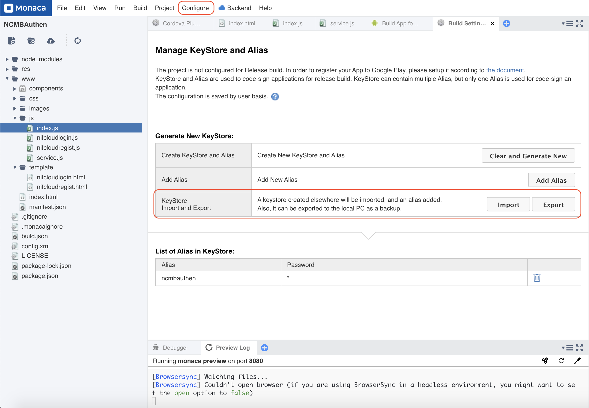
    - Build app for Android: From Monaca Cloud IDE menu, go to `Build → Build app for Android` and click `Start Build`
    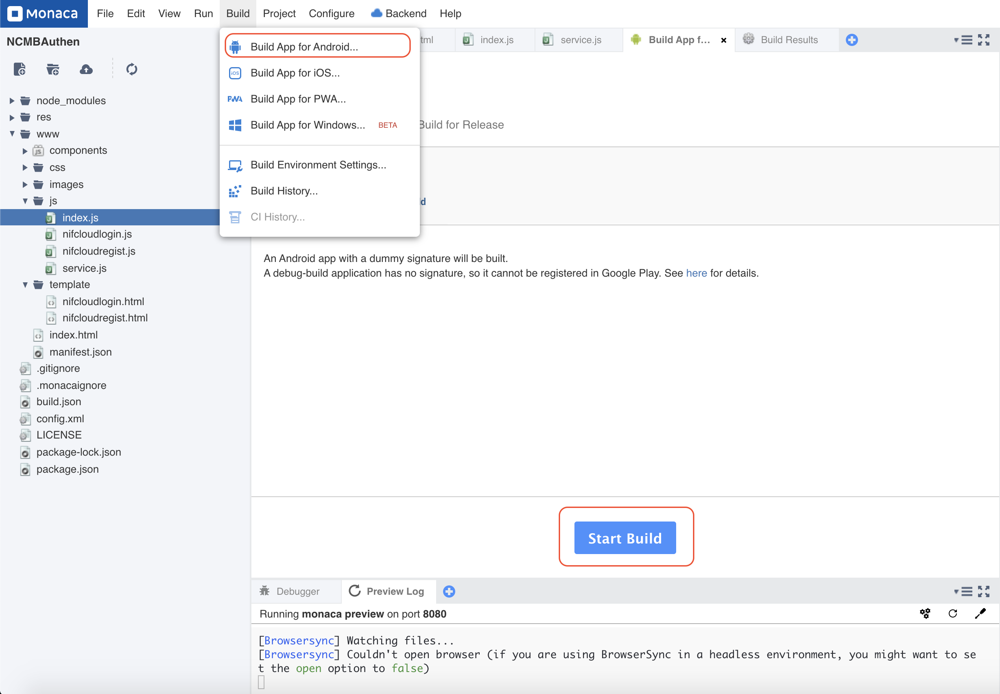
    - Please wait a moment.


<!-- ## ②Twitter
### （②Twitter）Twitter側作業手順

Twitter連携するように[cordova-plugin-twitter-connect-wkwebview](https://github.com/tien271/cordova-plugin-twitter-connect-wkwebview/releases/tag/v1.0.1)のプラグインを使います。このプラグインを使うように`TWITTER_KEY` と `TWITTER_SECRET`が必要です。これから`TWITTER_KEY` と `TWITTER_SECRET`の取得方法を説明します。

1. [Twitter Apps page](https://developer.twitter.com/en/portal/projects-and-apps)にログインします。
2. `Standalone Apps` click on `+ Create App` button.
 `Standalone Apps`のところで`+ Create App`でアプリを作成します。
3. 必須な情報を入力したら、 `Complete`でアプリを作成します。

※注意: `TWITTER_KEY`は`API key`で、`TWITTER_SECRET`は`API secret key`です。


5. 下のSetup your Appで`enable 3rd party authentication` のリンクをクリックします。


6. `App permission`を `Read and Write`に設定します。  
* `Authentication settings` で`3-legged OAuth is enabled`を有効いします。  
* また、Callback URLで`twittersdk://`を設定する必要があります。  
* 最後は`Website URL`のURLを入力してください。`Save` ボタンで保存します。  


### （②Twitter）管理画面上の設定

1. `App Settings`のところで`Social Login`を開きます
2. `allow`にチェックを入れます。
3.`TWITTER_KEY`を入力します。


### （②Twitter）Monacaの実装コード
#### （②Twitter）プラグイン設定

1. Monacaを開きます
2. 上記のメニューバーから`Configure → Cordova Plugin Settings`をキリックします。
3. `Enbaled plugins`のところで、 `cordova-plugin-twitter-connect-wkwebview`の`Configure`ボタンをクリックします。

4. 取得した`TWITTER_KEY`、`TWITTER_SECRET`、 `FABRIC_KEY`　を入れます。
※ `FABRIC_KEY`は`FABRIC_KEY=empty`です。

4. `OK`で完了します。

### コード説明
1. File Components

| File | Description |
| --- | --- |
| `index.html` | Login Page |
| `js/index.js` | 	A JavaScript file for implementation of the application |
| `js/service.js` | 	A JavaScript file for handle login  |


2. `config.xml`
```xml
<platform name="android">
    <preference name="android-minSdkVersion" value="22"/>
    ...
</platform>
```

3. `index.html`
```html
<button class="login-btn" onclick="onTwitterLoginBtn()">
    
    <span>Twitter</span>
</button>
```

4. `js/index.js`
```javascript
//------ Login with Twitter ------//
var twitterLoginSuccess = function(response) {
    onTwitterLogin(response);
};

var twitterLoginError = function(error) {
    console.log('Login Error: ' + JSON.stringify(error));
    alert('Error retrieving user profile' + JSON.stringify(error));
};

function onTwitterLoginBtn() {
    TwitterConnect.login(twitterLoginSuccess, twitterLoginError);
}
```

5. `js/service.js`
```javascript
/**
 * This const is your NCMB key
 */
const ncmbproperty = {
    application_key : "YOUR_APPLICATION_KEY",
    client_key: "YOUR_CLIENT_KEY"
};

/**
 * Your Twitter key :D
 */
const twitter_key = {
    oauth_consumer_key: "YOUR_TWITTER_KEY",
    consumer_secret: "YOUR_TWITTER_SECRET"
}

var ncmb = new NCMB(ncmbproperty.application_key, ncmbproperty.client_key);

//------ Login with Twitter ------//
function onTwitterLogin(response) {
    var authData = {
        id: response.id,
        screen_name: response.userName,
        oauth_consumer_key: twitter_key.oauth_consumer_key,
        consumer_secret: twitter_key.consumer_secret,
        oauth_token: response.authToken,
        oauth_token_secret: response.authTokenSecret
    };
    var user = new ncmb.User();
    user.signUpWith("twitter", authData)
    .then(function(resUser){
        return ncmb.User.loginWith(resUser);
    })
    .then(function(user){
        currentLoginUser = ncmb.User.getCurrentUser();
        alert("User Info: " + JSON.stringify(user));
    })
    .catch(function(err){
        alert("エラー" + JSON.stringify(err));
    });
}

function onTwitterLogout() {
    TwitterConnect.logout(
        function() {
            console.log('Successful logout!');
        },
        function() {
            console.log('Error logging out');
        }
    );
}
``` -->
